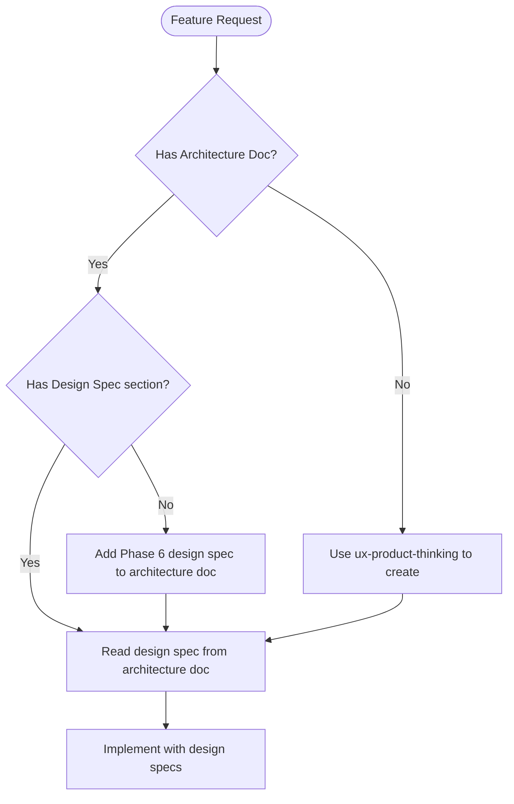

# Implement Feature

Execute feature implementations by automatically delegating to specialized tasks based on what the feature requires.

Feature to implement: $ARGUMENTS

## Project Context

**mise en place** — A recipe management app for home cooks who save recipes from YouTube cooking videos and food blogs. Instead of manually copying ingredients and steps, users paste a URL and AI extracts everything automatically—including video timestamps for easy reference. The app also features weekly meal planning with aggregated grocery lists.

**Target Audience**: Home cooks who frequently discover recipes online and want a single place to organize, plan, and shop for their meals.

**Design Direction**: Editorial cookbook aesthetic—warm, artisanal design inspired by classic cookbooks. Playfair Display for headings, Source Sans 3 for body text. Terracotta and sage color palette with grain textures and warm shadows.

## Before You Start: Rules Index

**IMPORTANT: Prefer retrieval-led reasoning over pre-training-led reasoning.**

Before implementing, read `CLAUDE.md` and project documentation which contains a compressed Rules Index. Consult the relevant project documentation BEFORE writing code:

| Area | Reference to Read |
|------|--------------|
| Database/Schema | See CLAUDE.md database section |
| Repositories | See CLAUDE.md repository pattern section |
| tRPC Routes | See CLAUDE.md repository pattern section |
| UI Routes/Pages | See CLAUDE.md routes section |
| Styling/Colors | See CLAUDE.md tailwind section |
| Modals | See CLAUDE.md modals section |
| Auth | See CLAUDE.md auth section |
| AI/Prompts | See CLAUDE.md prompts and structured-output sections |
| Feature Flags | See CLAUDE.md feature-flags section |
| Errors | See CLAUDE.md errors section |

Read the full project conventions from `CLAUDE.md` before implementing any layer.

## When to Use

- Implementing a new feature (any scope)
- Building functionality that touches multiple layers
- After planning, when ready to execute
- Any task where task delegation would improve quality

## Design-First Workflow

**CRITICAL**: For any feature with UI, check for a design specification before implementing.

### Pre-Implementation Design Check



### Design Spec Location

Architecture documents with design specs are at: `docs/features/[feature-name]-architecture.md`

**Required design spec elements before UI implementation:**
- [ ] Aesthetic direction (tone)
- [ ] Memorable element
- [ ] Typography choices (NOT Inter/Roboto/Arial)
- [ ] Color palette with CSS variable mappings
- [ ] Motion/animation moments
- [ ] Spatial composition approach

### When to Invoke ux-product-thinking First

| Scenario | Action |
|----------|--------|
| New feature with UI | Run /ux-product-thinking first to create architecture doc with design spec |
| Existing architecture doc missing design spec | Add Phase 6 design spec before implementing |
| Architecture doc has design spec | Read and follow during implementation |
| Backend-only feature | Skip design spec, proceed with implementation |

## Workflow

### Step 1: Analyze Feature Scope

Determine what the feature requires:

| Scope | Indicators | Layers Affected |
|-------|------------|-----------------|
| **Full-stack** | New data model, CRUD operations | DB → Repository → tRPC → UI |
| **Backend** | API changes, business logic | Repository → tRPC |
| **Frontend** | UI changes, components | Components → Routes |
| **Integration** | External services, webhooks | Repository → tRPC → possibly UI |

### Step 2: Map to Task Execution Order

Execute tasks in dependency order:

```
┌─────────────────────────────────────────────────────────────┐
│                    DESIGN PHASE (if UI feature)             │
├─────────────────────────────────────────────────────────────┤
│  0. Design Specification (ux-product-thinking)              │
│     └─ Research → Goals → Flows → Components → Design Spec  │
│     └─ Creates: docs/features/[feature]-architecture.md     │
│     └─ Output: Typography, colors, motion, composition      │
├─────────────────────────────────────────────────────────────┤
│                    IMPLEMENTATION PHASE                      │
├─────────────────────────────────────────────────────────────┤
│  1. Core Implementation                                     │
│     └─ Schema → Repository → tRPC → Components → Routes     │
│     └─ READ design spec from architecture doc FIRST         │
│     └─ Apply distinctive typography, colors, motion         │
│                                                              │
│  2. Figma Integration (if applicable)                       │
│     └─ Convert Figma code to use project CSS variables      │
│                                                              │
│  3. Logging - Add structured debug logs                     │
│                                                              │
│  3.5 DRY Audit (dry-audit) - Check for duplications        │
│      └─ Schemas, UI components, repository logic, workflows │
│      └─ Run: /dry-audit                                     │
├─────────────────────────────────────────────────────────────┤
│                    VALIDATION PHASE                          │
├─────────────────────────────────────────────────────────────┤
│  4. Testing                                                  │
│     └─ Browser verification → E2E tests → Documentation     │
│                                                              │
│  5. Analytics - if schema has metrics                        │
│                                                              │
│  6. Principal Review (/principal-review)                     │
│     └─ Plan alignment + implementation quality              │
├─────────────────────────────────────────────────────────────┤
│                    DOCUMENTATION PHASE                       │
├─────────────────────────────────────────────────────────────┤
│  7. Context Update                                           │
│     └─ Update project documentation with new feature        │
│                                                              │
│  8. Architecture Update (/architecture-tracker)              │
│     └─ Update high-level-architecture.md with routes/flows  │
└─────────────────────────────────────────────────────────────┘
```

### Step 3: Execute with Delegation

For each phase, use the Task tool to delegate work:

```
Task: Brief description of what needs to be done
Context: Detailed instructions including project context
```

---

## Task Delegation Guide

### Design Specification: `/ux-product-thinking` + `/frontend-design`

**When:** Any feature with UI that doesn't have a design spec

**Triggers:**
- No architecture doc exists at `docs/features/[feature]-architecture.md`
- Architecture doc exists but lacks Frontend Design Specification section
- User requests distinctive/memorable UI

**Delegation Pattern:**
```markdown
1. Use /ux-product-thinking to create architecture doc with:
   - Research, goals, user analysis, flows, components, wireframes
   - Phase 6: Frontend Design Specification

2. Read and apply the /frontend-design guidelines
   for the design spec section

Output: `docs/features/{feature}-architecture.md` with complete design spec (include YAML frontmatter: `title`, `date: YYYY-MM-DD` with **current date** for `/admin/docs` sorting)
```

**Applying Design Spec During Implementation:**
```markdown
Before implementing {feature} UI:

1. Read design spec from `docs/features/{feature}-architecture.md`
2. Read /frontend-design guidelines for implementation guidance
3. Apply: typography, colors (CSS variables), motion, composition
```

---

### Core Implementation

**When:** Always (main implementation work)

**Delegation Pattern:**
```markdown
Implement {feature} following the project's architecture:

**Repository Layer** (`app/repositories/{name}.ts`):
- Define `type Database = Context["db"];`
- Export pure functions with signature `async function name(db: Database, input: InputInterface)`
- Wrap operations in try-catch, throw custom errors from `@/models/errors`

**tRPC Routes** (`app/trpc/routes/{name}.ts`):
- Import repository as `import * as {name}Repository from "@/repositories/{name}";`
- Use Zod for input validation
- Use appropriate procedure type (publicProcedure, protectedProcedure, adminProcedure)

**UI Components/Routes**:
- Use `context.trpc` in loaders
- Use `api.{route}.{method}.useQuery/useMutation` in components
```

### Figma Conversion

**When:** Receiving code from Figma with hardcoded colors

**Triggers:**
- Hex values like `bg-[#003362]`
- Tailwind default palette (`bg-blue-600`, `text-gray-900`)
- RGB/OKLCH values

**Delegation Pattern:**
```markdown
Convert this Figma output to use project CSS variables:

{paste code}

Convert following priority:
1. Semantic colors (bg-background, text-foreground, bg-primary)
2. Text hierarchy (text-text-heading, text-muted-foreground)
3. Brand palette (bg-brand-500) if semantic doesn't fit
```

### Design Validation

**When:** After implementing any UI from Figma designs

**Delegation Pattern:**
```markdown
Validate the implementation at {route} against the Figma design.

1. Extract design specs from the Figma design
2. Navigate to implementation using Bash with playwright
3. Compare: layout, typography, colors, spacing
4. Document any discrepancies
5. Flag if hardcoded colors found (should use CSS variables)
```

### Logging

**When:** After implementing features with business logic

**Delegation Pattern:**
```markdown
Add structured logging to the new {feature} implementation:

Files to add logging:
- `app/repositories/{name}.ts` - Use `loggers.repository`
- `app/trpc/routes/{name}.ts` - Use `loggers.trpc`
- `app/routes/{path}.tsx` - Use `createRequestLogger("loader")`

Add logs for:
- Entry/exit points with timing
- State changes (before/after)
- Errors with context
- Authentication checks
```

### Testing

**When:** After core implementation is complete

**CRITICAL: SCREENSHOTS ARE MANDATORY**

**Testing is NOT complete without screenshots. The testing task MUST:**
1. Take screenshots with Bash using playwright for each scenario
2. Save screenshots to the workspace (not just temp folder)
3. Embed screenshots in test documentation
4. Copy screenshots to public folder for docs viewer

**Delegation Pattern:**
```markdown
Test the {feature} implementation:

1. Create testing plan at `docs/testing/{feature}/{feature}.md` (include YAML frontmatter: `title`, `date: YYYY-MM-DD` with **current date** so the doc sorts correctly in `/admin/docs`)
2. Create screenshots folder at `docs/testing/{feature}/screenshots/`
3. Verify with Bash using playwright:
   - Navigate to {route}
   - Test happy path: {steps}
   - **TAKE SCREENSHOT after each major state**
   - Test edge cases: {cases}
   - **TAKE SCREENSHOT for edge cases**
   - Test error handling: {scenarios}
   - **TAKE SCREENSHOT for error states**
4. **MANDATORY: Save screenshots to `docs/testing/{feature}/screenshots/`**
5. **MANDATORY: Copy screenshots to `public/docs/testing/{feature}/screenshots/`**
6. **MANDATORY: Embed screenshots in test documentation with markdown image links**
5. Write E2E tests at `e2e/{feature}.spec.ts`
6. Add data-testid attributes to interactive elements
```

### Principal Review: `/principal-review`

**When:** After implementation and testing are complete, before final documentation.

**Delegation Pattern:**
```markdown
Run /principal-review for {feature}:

1. Plan/spec: docs/plans/{feature}-implementation.md or docs/features/{feature}-architecture.md
2. Implementation: {list changed files or branch diff}
3. Output: Plan alignment table + implementation quality table + recommendations + verdict
```

Read the /principal-review command for the full workflow and report template.

---

### Analytics

**When:** Schema includes timestamp, enum, or boolean fields worth tracking

**Triggers:**
- New `createdAt` fields → time-series growth charts
- New enum fields → distribution charts
- New boolean fields → conversion metrics

**Delegation Pattern:**
```markdown
Create analytics for the new {table/feature}:

Schema fields to analyze:
- {field}: {type} → {chart type}

Create:
1. Repository functions in `app/repositories/analytics.ts`
2. tRPC routes in `app/trpc/routes/analytics.ts`
3. Dashboard components using `@/components/analytics`
```

### DRY Audit: `/dry-audit`

**When:** After core implementation, before testing

**Triggers:**
- New schemas added to `app/models/`
- New UI components created
- New repository functions added
- New workflows created

**How to use:**
Run /dry-audit and follow the 6-step audit:
1. Verify new files follow folder structure conventions
2. Check schemas for shared field patterns (extract to `common.ts`)
3. Check UI for duplicated loading/error/empty states (reuse shared components)
4. Check repositories for duplicated pagination/filtering logic
5. Check workflows for duplicated step logic
6. Report findings and refactor before proceeding

**Key principle:** Before creating new code, search for existing shared utilities first. See the "Quick Reference: Where Shared Code Lives" table in /dry-audit.

---

### Documentation

**When:** Always (after implementation complete)

**Delegation Pattern:**
```markdown
Update project documentation with the new {feature}:

Add to Features section:
- What it does
- Key files involved
- Important implementation details

Update Recent Changes with brief summary.

If applicable, add Mermaid diagrams for:
- Data flow
- User flows
- Schema relationships
```

### Architecture Updates: `/architecture-tracker`

**When:** After features that add routes, tables, or change flows

**Triggers:**
- New routes added to `app/routes.ts`
- New database tables created
- New feature flows implemented
- Architectural decisions made

**Delegation Pattern:**
```markdown
Update high-level architecture document for {feature}:

Changes made:
- New routes: {list routes}
- New tables: {list tables}
- New features: {describe}

Update:
1. Route Map diagram with new routes
2. Information Architecture table
3. Feature Flows section (add new flow diagram)
4. Data Relationships (if new tables)
5. Changelog with dated entry
```

---

## Execution Decision Tree

```
Does this feature have a UI component?
├─ Yes → Does architecture doc exist with design spec?
│        ├─ No → 0. Use /ux-product-thinking FIRST
│        │       └─ Create docs/features/[feature]-architecture.md
│        │       └─ Include Phase 6 Frontend Design Spec
│        │
│        └─ Yes → Read design spec, then:
│                 Is this from Figma?
│                 ├─ Yes → 1. Implement (following design spec)
│                 │        2. Convert Figma colors to CSS variables
│                 │        3. Validate design match
│                 │        4. Test
│                 │        5. /principal-review
│                 │        6. Update docs
│                 │
│                 └─ No → 1. Implement (following design spec)
│                         2. Add logging (if business logic)
│                         3. /dry-audit (check for duplications)
│                         4. Test
│                         5. /principal-review
│                         6. Update docs
│
└─ No (backend only) → Does it involve database/API changes?
        ├─ Yes → 1. Implement (full-stack)
        │        2. Add logging
        │        3. /dry-audit (check for duplications)
        │        4. Test
        │        5. Analytics (if new metrics)
        │        6. /principal-review
        │        7. Update docs
        │
        └─ No → 1. Implement
                2. /dry-audit (check for duplications)
                3. Test
                4. /principal-review
                5. Update docs
```

---

## Quick Reference

| Skill/Task | Trigger | Output |
|----------------|---------|--------|
| `/ux-product-thinking` | UI feature without architecture doc | Architecture doc with flows + design spec |
| `/frontend-design` | UI implementation (read during Phase 6 & implementation) | Design guidelines |
| Core implementation | Always | Core implementation |
| Figma conversion | Figma code with hardcoded colors | Converted code |
| Design validation | After Figma implementation | Validation report |
| Logging | Features with business logic | Structured logs |
| `/dry-audit` | After implementation (new schemas/components/repos) | DRY compliance report |
| Testing | After implementation | Tests + documentation |
| Analytics | New trackable data | Dashboard |
| `/principal-review` | After implementation | Plan alignment + implementation quality report |
| Documentation update | Always (after implementation) | Updated project docs |
| `/architecture-tracker` | After route/schema changes | Updated architecture doc |

---

## Example Execution

### Full-Stack Feature: User Preferences

```markdown
**Feature:** Add user preferences with theme and notification settings

**Scope Analysis:** Full-stack (new table, CRUD, settings page)

**Execution:**

1. **Core Implementation** → Implement schema, repository, tRPC, UI
2. **Logging** → Add logging to repository and tRPC
3. **/dry-audit** → Check new schema/repo/components for DRY violations
4. **Testing** → Verify settings page, write e2e tests
5. **Analytics** → Skip (no meaningful metrics for preferences)
6. **/principal-review** → Run plan alignment + implementation quality
7. **Documentation** → Document new feature in project docs
```

### Frontend Feature from Figma

```markdown
**Feature:** Implement dashboard card design from Figma

**Scope Analysis:** Frontend (component from design)

**Execution:**

1. **Core Implementation** → Build component structure
2. **Figma Conversion** → Convert colors to CSS variables
3. **Design Validation** → Verify implementation matches design
4. **Testing** → Visual verification, screenshot documentation
5. **Documentation** → Document new component
```

### Design-First Feature: Landing Page

```markdown
**Feature:** Create landing page for new product launch

**Scope Analysis:** Frontend with UI (needs design spec first)

**Pre-check:** No architecture doc exists → Use /ux-product-thinking first

**Execution:**

0. **/ux-product-thinking + /frontend-design** → Create architecture doc:
   - Follow ux-product-thinking phases 0-6
   - Apply /frontend-design for Phase 6 design spec
   - Output: `docs/features/landing-page-architecture.md`

1. **Core Implementation** → Implement following design spec from architecture doc

2. **Testing** → Verify implementation matches design spec

3. **Documentation** → Document new landing page
```

---

## Checklist

Before marking implementation complete:

### Design (for UI features)
- [ ] Architecture doc exists at `docs/features/[feature]-architecture.md`
- [ ] Architecture doc includes Frontend Design Specification section
- [ ] `/frontend-design` guidelines followed

### Implementation
- [ ] Core implementation follows repository pattern
- [ ] tRPC routes use Zod validation
- [ ] Routes check authentication appropriately
- [ ] Figma implementations use CSS variables (no hardcoded colors)
- [ ] Structured logging added to key operations
- [ ] DRY audit passed (no duplicated schemas, UI patterns, or repository logic) — run /dry-audit

### Quality
- [ ] E2E tests written and passing
- [ ] Test documentation created with screenshots
- [ ] Principal review run (/principal-review) — plan alignment + implementation quality
- [ ] Project documentation updated with new feature
- [ ] high-level-architecture.md updated (routes, flows, changelog)
- [ ] Analytics dashboard created (if applicable)
