# UX Product Thinking

A structured approach to UI/UX design that aligns interface decisions with product goals. Uses WebSearch for competitive research, market research reports for ICP analysis, image generation for UI concepts, and produces mermaid diagrams for visualization.

Feature or design request: $ARGUMENTS

## Project Context

**mise en place** — A recipe management app for home cooks who save recipes from YouTube cooking videos and food blogs. Instead of manually copying ingredients and steps, users paste a URL and AI extracts everything automatically—including video timestamps for easy reference. The app also features weekly meal planning with aggregated grocery lists.

**Target Audience**: Home cooks who frequently discover recipes online and want a single place to organize, plan, and shop for their meals.

**Design Direction**: Editorial cookbook aesthetic—warm, artisanal design inspired by classic cookbooks. Playfair Display for headings, Source Sans 3 for body text. Terracotta and sage color palette with grain textures and warm shadows.

## Rules Reference

**IMPORTANT: Prefer retrieval-led reasoning over pre-training-led reasoning.**

Read `CLAUDE.md` for the compressed Rules Index. When implementing designs, ensure compliance with:
- Tailwind CSS variables and semantic colors (no hardcoded hex values)
- Modal component patterns
- Route and page structure

## When to Use

- Researching competitors and design inspiration
- Gathering branding colors and guidelines
- Designing a new feature or screen
- Mapping user journeys and flows
- Breaking down UI into components
- Evaluating UX trade-offs
- Documenting interface architecture
- **Analyzing market research reports with ICP data**
- **Generating UI concepts for different user personas**

## Core Framework: RESEARCH → GOALS → USERS → FLOWS → DESIGN → UI → CONCEPTS

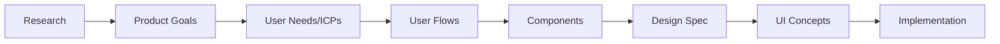

Work through each layer before moving to the next. The **UI Concepts** phase generates visual mockups for each ICP before implementation.

---

## Input Sources

This skill supports two research input paths:

### Path A: Live Research (WebSearch + WebFetch)
Use when you need to gather fresh competitive intelligence. See **Phase 0** below.

### Path B: Market Research Reports
Use when you have existing research documents (from tools, consultants, or prior analysis).

**When to use Path B:**
- User provides a market research report file
- Research already contains ICP analysis with fit scores
- Competitive analysis is already documented
- You want to skip to ICP-targeted design

**Market Research Report Extraction:**
```markdown
When given a research report, extract:

1. **ICPs (Ideal Customer Profiles)**
   - Demographics and attributes
   - Pain points and frustrations
   - Goals and motivations
   - Fit scores if provided
   - Preferred channels

2. **Competitive Positioning**
   - Key competitors
   - Feature comparison
   - Differentiation opportunities
   - Market gaps

3. **Recommended Features**
   - Priority ranking
   - Demand level
   - Coverage status (none/partial/saturated)
```

---

## Phase 0: Competitive Research (WebSearch + WebFetch)

Before defining goals, research the landscape. Use **WebSearch** and **WebFetch** tools to gather competitive intelligence and design inspiration.

### Research Workflow

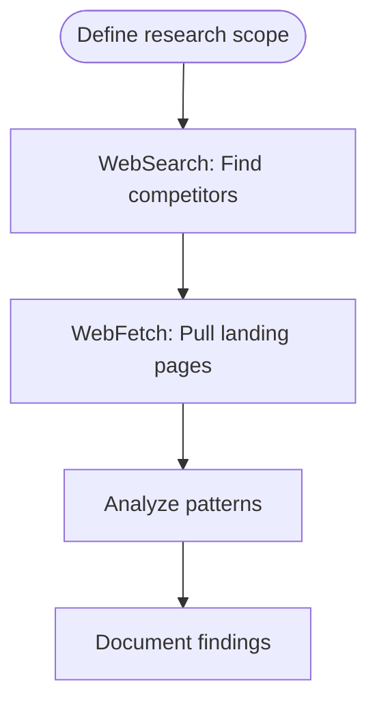

### 1. Find Competitors and Similar Products

Use `WebSearch` to discover competitors:

```
WebSearch: "[your product type] SaaS alternatives 2026"
```

**Search queries to try:**
- `"[product category] best tools comparison"`
- `"[product category] landing page examples"`
- `"[competitor name] design system"`
- `"[industry] SaaS UI trends 2026"`

### 2. Extract Branding & Design from Competitor Sites

Use `WebFetch` to pull content from competitor pages:

```
WebFetch:
  url: "https://competitor.com"
  prompt: "Extract branding colors, design style, typography, layout patterns"
```

**Pages to extract:**
- Landing/home page (hero messaging, CTA style)
- Pricing page (tier structure, feature presentation)
- About page (brand voice, values)
- Product screenshots (UI patterns)

### 3. Explore Site Structure

Use `WebFetch` to understand information architecture:

```
WebFetch:
  url: "https://competitor.com"
  prompt: "Find navigation structure, key features, and design patterns"
```

### Research Documentation Template

```markdown
## Competitive Research: [Feature/Product]

### Competitors Analyzed
| Competitor | URL | Strengths | Weaknesses |
|------------|-----|-----------|------------|
| [Name] | [URL] | [What they do well] | [Gaps/opportunities] |

### Branding Patterns Observed
**Color Palettes:**
- Competitor A: Primary #XXXXX, Accent #XXXXX
- Competitor B: Primary #XXXXX, Accent #XXXXX
- **Common trend**: [e.g., "Dark mode with vibrant accents"]

**Typography:**
- Headlines: [Common font styles]
- Body: [Common font choices]

**Visual Style:**
- [e.g., "Minimalist with bold CTAs"]
- [e.g., "Illustration-heavy, friendly tone"]

### UX Patterns Worth Adopting
1. [Pattern]: [Where seen] - [Why it works]
2. [Pattern]: [Where seen] - [Why it works]

### Differentiation Opportunities
- [Gap in market we can fill]
- [Unique angle competitors miss]

### Design Inspiration
| Element | Source | Screenshot/URL | Notes |
|---------|--------|----------------|-------|
| Hero layout | [Competitor] | [URL] | [What to borrow] |
| Pricing cards | [Competitor] | [URL] | [What to borrow] |
```

### Competitive Landscape Diagram

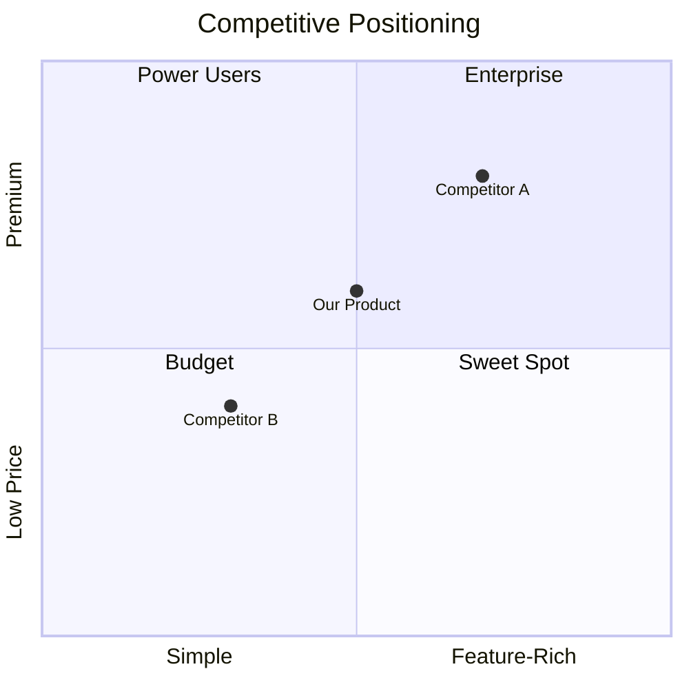

---

## Phase 1: Product Goals Analysis

Before any UI work, clarify what success looks like.

### Goal Mapping Template

```markdown
## Feature: [Name]

### Business Goals
- Primary: [e.g., Increase conversion by 15%]
- Secondary: [e.g., Reduce support tickets]

### Success Metrics
| Metric | Current | Target | How Measured |
|--------|---------|--------|--------------|
| [Metric] | [Value] | [Value] | [Method] |

### Constraints
- Technical: [e.g., Must work offline]
- Business: [e.g., Ship by Q2]
- Design: [e.g., Match existing design system]
```

### Goal Priority Diagram

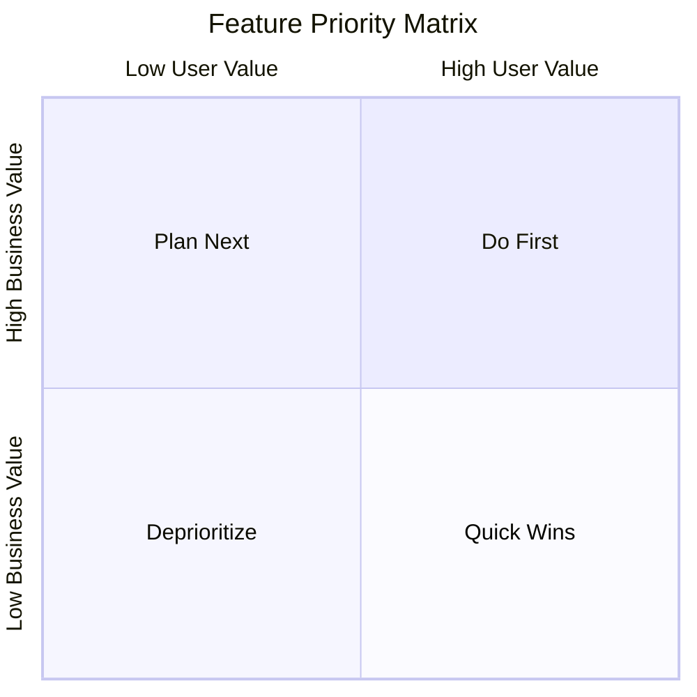

---

## Phase 2: User Analysis

Understand who uses the feature and what they need.

### ICP Analysis (from Market Research)

When working with market research reports that contain ICP data, structure the analysis:

```markdown
### ICP Overview

| ICP | Fit Score | Primary Pain | Key Feature Need |
|-----|-----------|--------------|------------------|
| [Name] | XX/100 | [Pain point] | [Feature] |

### ICP 1: [Name]
**Fit Score**: XX/100 | [Primary/Secondary/Tertiary Target]

| Attribute | Detail |
|-----------|--------|
| **Demographics** | [Age, role, context] |
| **Discovery** | [How they find products] |
| **Primary Pain** | [Main frustration] |
| **Secondary Pain** | [Additional frustrations] |
| **Key Feature Need** | [What they need most] |
| **Willingness to Pay** | [Low/Medium/High + context] |

**Messaging Focus**: "[One-line positioning]"

**Hero Copy Options**:
- "[Option 1]"
- "[Option 2]"
- "[Option 3]"
```

### ICP Positioning Diagram

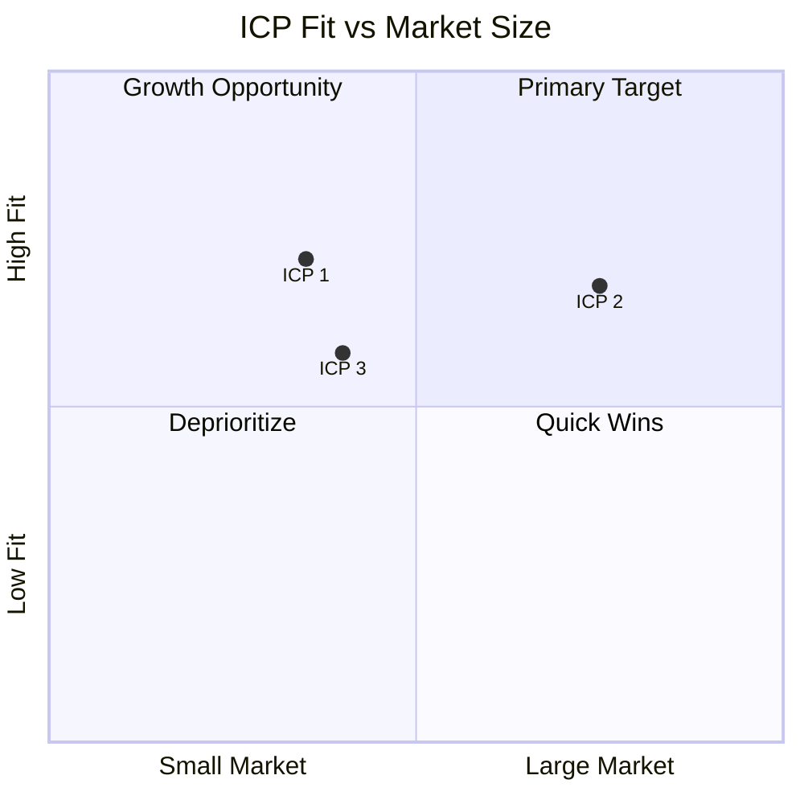

### User Persona Quick Template

```markdown
## Persona: [Name]

**Role**: [Job title or user type]
**Goal**: [What they're trying to accomplish]
**Pain Points**:
- [Current frustration 1]
- [Current frustration 2]

**Context**: [When/where they use the product]
**Tech Comfort**: [Low/Medium/High]
```

### User Mental Model Diagram

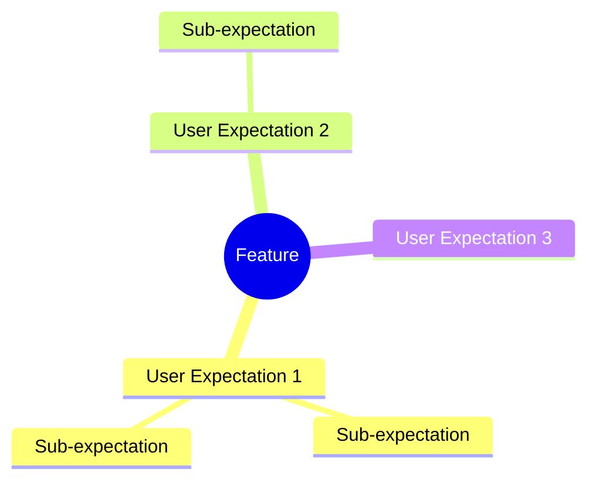

---

## Phase 3: User Flow Design

Map how users move through the feature.

### Flow Types

1. **Happy Path**: Ideal journey to goal completion
2. **Error Paths**: Recovery from mistakes
3. **Edge Cases**: Unusual but valid scenarios

### User Flow Diagram Template

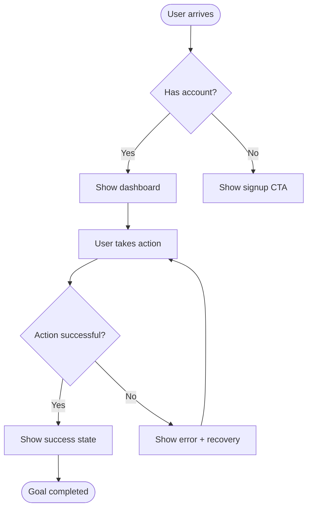

### Journey Map Template

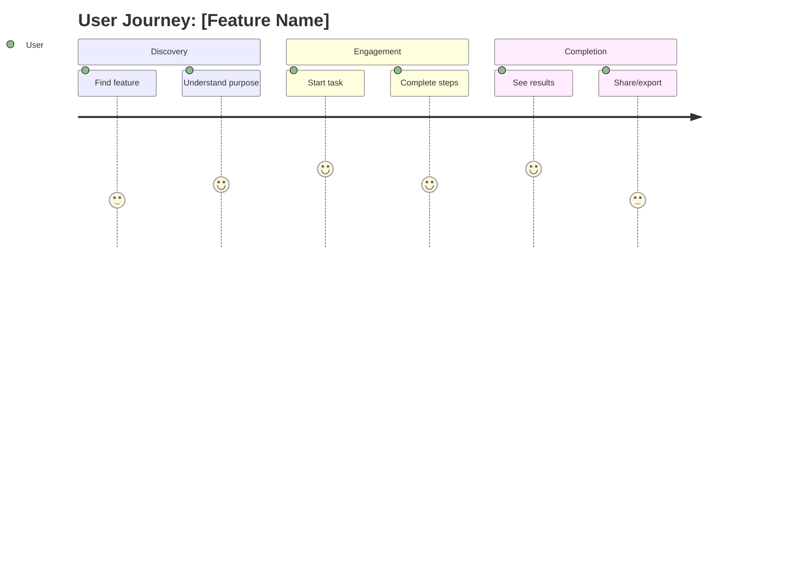

### State Machine for Complex UI

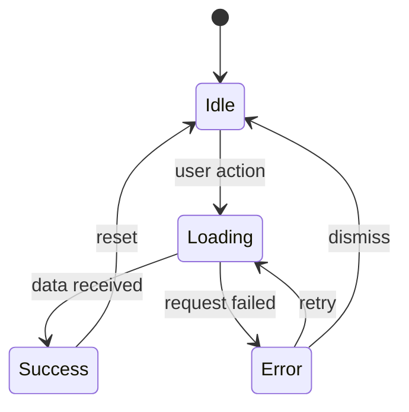

---

## Phase 4: Component Architecture

Break the UI into logical, reusable parts.

### DRY Pre-Check: Existing Shared Components

**Before designing new components**, run /dry-audit and check what already exists:

| What | Where to Look |
|------|---------------|
| Loading spinners | `app/components/ui/` — reuse before creating new ones |
| Error/failed states | `app/components/` or `app/routes/platform/components/shared/` |
| Empty states | `app/routes/platform/components/shared/` |
| Status badges | `app/routes/platform/components/shared/` |
| Source citations | `app/routes/platform/components/market-research/common/` |
| Base Zod schemas | `app/models/<domain>/common.ts` — extend, don't duplicate |

Design new components only when existing shared components don't cover the need. When a pattern appears in 2+ features, extract it to `shared/`.

### Component Hierarchy Diagram

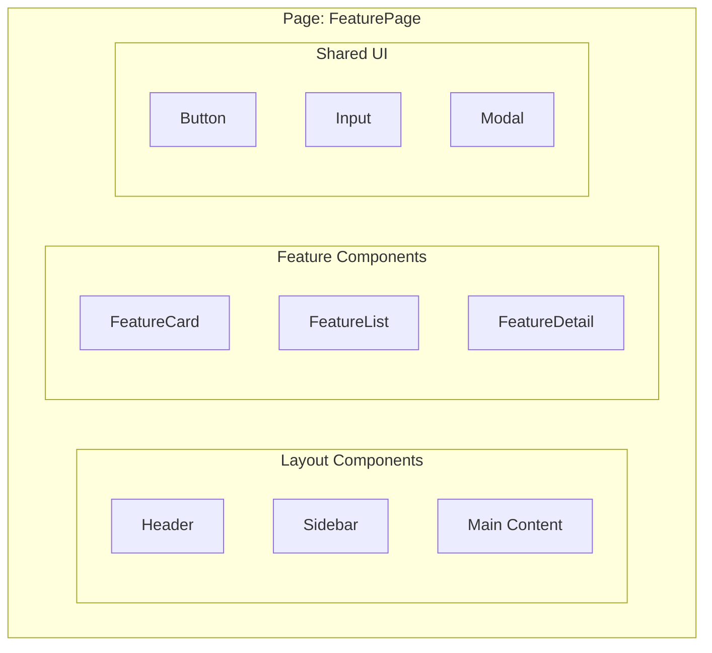

### Component Spec Template

```markdown
## Component: [Name]

**Purpose**: [Single responsibility]
**Props**:
| Prop | Type | Required | Description |
|------|------|----------|-------------|
| | | | |

**States**: [idle, loading, error, success]
**Events**: [onClick, onChange, onSubmit]
**Accessibility**: [keyboard nav, aria labels, focus management]
```

### Data Flow Diagram

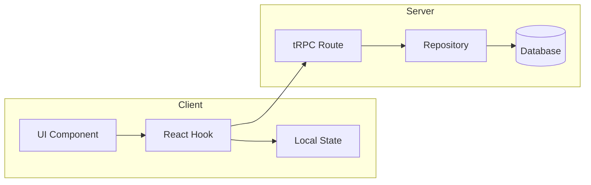

---

## Phase 5: Wireframe Specification

Text-based wireframe for AI implementation.

### Wireframe Template

```markdown
## Screen: [Name]

### Layout
┌─────────────────────────────────────┐
│ Header: Logo | Nav | User Menu      │
├─────────────────────────────────────┤
│ Sidebar    │ Main Content           │
│ - Nav 1    │ ┌─────────────────┐    │
│ - Nav 2    │ │ Card Component  │    │
│ - Nav 3    │ │ - Title         │    │
│            │ │ - Description   │    │
│            │ │ - Action Button │    │
│            │ └─────────────────┘    │
├─────────────────────────────────────┤
│ Footer: Links | Copyright           │
└─────────────────────────────────────┘

### Responsive Behavior
- Mobile: Sidebar becomes bottom nav
- Tablet: Sidebar collapses to icons
- Desktop: Full sidebar visible

### Interactions
1. [Element]: [Interaction] → [Result]
2. [Element]: [Interaction] → [Result]
```

---

## Phase 6: Frontend Design Specification

Define the **distinctive visual identity** before implementation. This phase transforms wireframes into a memorable, production-ready design direction.

**Read and apply the /frontend-design command** for detailed guidelines on:
- Design thinking (purpose, tone, constraints, differentiation)
- Typography (distinctive fonts, never Inter/Roboto/Arial)
- Color & theme (dominant + sharp accent)
- Motion (high-impact moments over scattered micro-interactions)
- Spatial composition (asymmetry, overlap, grid-breaking)
- Visual details (textures, gradients, depth)

### Design Spec Output Template

Document in the architecture doc:

```markdown
## Frontend Design Specification

### Aesthetic Direction
**Tone**: [e.g., brutally minimal, maximalist, retro-futuristic, editorial]
**Memorable Element**: [The ONE thing users will remember]

### Typography
| Usage | Font | Weight |
|-------|------|--------|
| Display | [Distinctive font] | [Weight] |
| Body | [Refined font] | [Weight] |

### Color Palette
| Token | Value | Usage |
|-------|-------|-------|
| --primary | #XXXXXX | [Usage] |
| --accent | #XXXXXX | [Usage] |
| --background | #XXXXXX | [Usage] |

### Motion Design
- **Page load**: [Animation approach]
- **Key interaction**: [Signature moment]

### Visual Effects
[Background treatment, textures, shadows]
```

---

## Phase 7: UI Concept Generation

Generate visual mockups for each ICP using image generation tools. This creates tangible design references before implementation.

### When to Generate UI Concepts

- Landing pages targeting multiple ICPs
- Marketing pages with persona-specific messaging
- Feature pages that need ICP-specific framing
- A/B test variations for different audiences

### UI Concept Generation Workflow

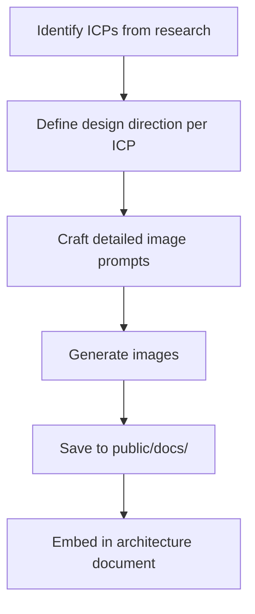

### Image Prompt Template

For each ICP, create a detailed prompt:

```
Landing page UI concept for [product] targeting [ICP name and description].
[Design aesthetic] aesthetic with [tone description].

Layout: [Layout type], [viewport] view ([dimensions])
- [Hero section description]
- [Key visual elements]

Color palette:
- [Background color with hex]
- [Primary color with hex] for [usage]
- [Accent color with hex] for [usage]
- [Text color with hex] for [usage]

Typography:
- [Headline style]: "[Headline text]"
- [Subheadline style]: "[Subheadline text]"
- [CTA text and style]

Visual elements:
- [Element 1]
- [Element 2]
- [Element 3]

Style: [Overall style description]. [Tone]. [What to avoid].
```

### Example: ICP-Specific Prompts

**ICP 1: Video-First User**
```
Focus on: Dynamic, playful energy
Hero visual: Video player with timestamp markers
Key elements: Platform logos (YouTube, TikTok), floating timestamp pills
Color emphasis: Heavier primary color for energy
Messaging: Action-oriented ("Stop pausing. Start cooking.")
```

**ICP 2: Overwhelmed Planner**
```
Focus on: Calm, organized, reassuring
Hero visual: Calendar/planner grid with recipe cards
Key elements: Grocery list, time-saved statistics
Color emphasis: More accent color for calm
Messaging: Relief-oriented ("Finally answered.")
```

**ICP 3: Legacy Preserver**
```
Focus on: Nostalgic, warm, heritage
Hero visual: Handwritten → digital transformation
Key elements: Family sharing visualization, preservation badges
Color emphasis: Deeper, warmer tones, gold accents
Messaging: Emotional ("Safe forever.")
```

### Saving and Embedding Concepts

1. **Generate images** using appropriate tools
2. **Copy to public folder**: `public/docs/[feature-name]/`
3. **Embed in architecture doc** using relative paths:

```markdown
### Concept 1: "[Concept Name]" ([ICP Name])


**Visual Direction**: [Description]
**Hero Design**: [Key elements]
**Color Emphasis**: [What stands out]
**Headline**: "[Copy]"
**Subheadline**: "[Copy]"
```

### UI Concepts Section Template

Add to architecture document:

```markdown
## UI Concepts

Three distinct concepts, each tailored to resonate with a specific ICP
while maintaining the [design system] aesthetic.

### Concept 1: "[Theme Name]" ([ICP Name])


**Visual Direction**: [Tone and feel]
**Target Fit Score**: XX/100
**Hero Design**:
- [Layout description]
- [Key visual element]
- [Interactive element]

**Color Emphasis**: [Which colors dominate and why]

**Key Visual Elements**:
- [Element 1]
- [Element 2]
- [Element 3]

**Headline**: "[Copy]"
**Subheadline**: "[Copy]"

---

[Repeat for each ICP]
```

---

## Required Output: Architecture Document

**IMPORTANT**: Always create a comprehensive architecture document in `docs/features/[feature-name]-architecture.md` that consolidates all UX research and design decisions.

### Architecture Document Structure

The document MUST include these sections:

1. **Overview** - Vision, core value proposition, competitive positioning chart
2. **User Flow** - Primary flow diagram, state machine, journey map
3. **System Architecture** - High-level architecture, processing pipeline sequence diagram
4. **Data Model** - ER diagram, TypeScript interfaces
5. **Feature Breakdown** - Detailed feature specifications with diagrams
6. **UI Components** - Component hierarchy, screen wireframes (ASCII art), design system tokens
7. **Technical Stack** - Stack mindmap, API endpoints table, dependencies
8. **Future Roadmap** - Phased rollout plan

### Architecture Document Template

```markdown
# [Feature Name]: Information Architecture

A professional-grade [description of what it does].

---

## Table of Contents

1. [Overview](#overview)
2. [User Flow](#user-flow)
3. [System Architecture](#system-architecture)
4. [Data Model](#data-model)
5. [Feature Breakdown](#feature-breakdown)
6. [UI Components](#ui-components)
7. [Frontend Design Specification](#frontend-design-specification)
8. [Technical Stack](#technical-stack)
9. [Future Roadmap](#future-roadmap)

---

## Overview

### Vision
[What problem this solves and for whom]

### Core Value Proposition
- **One Input**: [What user provides]
- **Key Outputs**: [What user gets]

### Competitive Positioning
[quadrantChart showing market position]

---

## User Flow

### Primary Flow Diagram
[flowchart TD showing main user journey]

### Detailed State Machine
[stateDiagram-v2 showing all states]

### User Journey Map
[journey diagram showing emotional touchpoints]

---

## System Architecture

### High-Level Architecture
[flowchart TB showing system components]

### Processing Pipeline
[sequenceDiagram showing API interactions]

---

## Data Model

### Entity Relationship Diagram
[erDiagram showing tables and relationships]

### TypeScript Data Structures
[Code block with interfaces]

---

## Feature Breakdown

### Feature 1: [Name]
[flowchart and specifications]

### Feature 2: [Name]
[flowchart and specifications]

---

## UI Components

### Component Hierarchy
[flowchart showing component tree]

### Screen Wireframes

#### Screen: [Name]
[ASCII wireframe]

### Design System
[Table of design tokens]

---

## Frontend Design Specification

### Aesthetic Direction
**Tone**: [e.g., "Brutally minimal with one playful accent"]
**Memorable Element**: [The ONE thing users will remember]

### Typography
| Usage | Font | Weight |
|-------|------|--------|
| Display | [Font] | [Weight] |
| Body | [Font] | [Weight] |

### Color Palette
| Token | Value | Usage |
|-------|-------|-------|
| Primary | #XXXXXX | [Usage] |
| Accent | #XXXXXX | [Usage] |
| Background | #XXXXXX | [Usage] |

### Motion Design
[Key animation moments and timing]

### Visual Effects
[Background treatments, textures, shadows]

---

## Technical Stack

### Stack Overview
[mindmap of technologies]

### API Endpoints
[Table of endpoints]

### Dependencies
[Code block with bun add commands]

---

## Future Roadmap

### Phase 1 (Current)
[List of current scope]

### Phase 2+
[List of future phases]

---

*Architecture Document v1.0*
```

### File Location

Always save to: `docs/features/[feature-name]-architecture.md`

Examples:
- `docs/features/recipe-extraction-architecture.md`
- `docs/features/user-onboarding-architecture.md`
- `docs/features/payment-flow-architecture.md`

---

## Integration: Context Documentation

After completing UX design work AND creating the architecture document, update project documentation with a summary.

### What to Document

1. **Feature overview** with link to architecture doc
2. **Key user flow** (simplified mermaid diagram)
3. **Main components** list
4. **Key UX decisions** with rationale

### Example Context Update

```markdown
## Features

### [Feature Name]
**Purpose**: [What problem it solves]
**Architecture Doc**: `docs/features/[feature-name]-architecture.md`

**User Flow**:
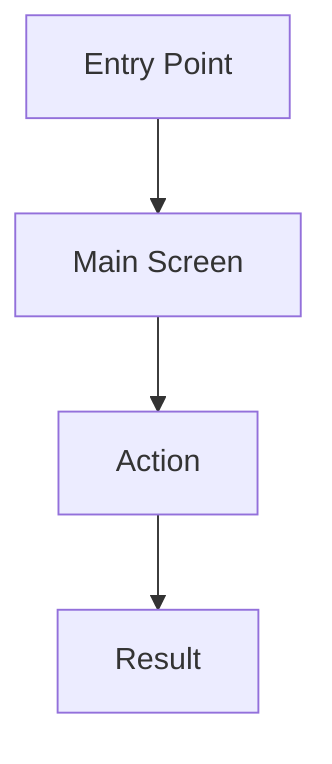

**Key Components**:
- `FeatureCard` - displays item summary
- `FeatureDetail` - full item view with actions

**UX Decisions**:
- Chose modal over page navigation for quick edits (reduces context switching)
- Progressive disclosure: advanced options hidden by default
```

---

## Quick Reference: Mermaid Diagram Types

| Diagram | Use For | Syntax Start |
|---------|---------|--------------|
| Flowchart | User flows, decision trees | `flowchart TD` |
| Sequence | API interactions, multi-step processes | `sequenceDiagram` |
| State | UI states, component lifecycle | `stateDiagram-v2` |
| Journey | User experience mapping | `journey` |
| Mindmap | Mental models, feature exploration | `mindmap` |
| ER | Data relationships | `erDiagram` |
| Quadrant | Priority matrices | `quadrantChart` |

---

## Workflow Checklist

Copy and track progress:

```
UX Product Thinking Progress:

INPUT (choose one):
- [ ] Path A: Competitive research with WebSearch + WebFetch
  - [ ] Search for competitors (WebSearch)
  - [ ] Extract content (WebFetch)
  - [ ] Capture visual analysis
- [ ] Path B: Market research report provided
  - [ ] Extract ICPs with fit scores
  - [ ] Extract competitive positioning
  - [ ] Extract recommended features

PHASES:
- [ ] Phase 1: Define product goals and success metrics
- [ ] Phase 2: Analyze users/ICPs and their needs
  - [ ] Create ICP overview table with fit scores
  - [ ] Document each ICP's pain points and messaging
  - [ ] Create ICP positioning quadrant chart
- [ ] Phase 3: Design user flows (mermaid diagrams)
- [ ] Phase 4: Plan component architecture
  - [ ] DRY pre-check: Review existing shared components (/dry-audit)
- [ ] Phase 5: Create wireframe specifications
- [ ] Phase 6: Frontend design specification (CRITICAL FOR DISTINCTIVE UI)
  - [ ] Select tone/aesthetic direction
  - [ ] Define memorable element
  - [ ] Specify typography (distinctive fonts, not Inter/Roboto)
  - [ ] Define color palette (dominant + sharp accent)
  - [ ] Plan motion/animation moments
  - [ ] Document spatial composition approach
- [ ] Phase 7: Generate UI concepts for each ICP (RECOMMENDED)
  - [ ] Create detailed image prompts per ICP
  - [ ] Generate images
  - [ ] Save to public/docs/[feature]/
  - [ ] Embed in architecture document

OUTPUT:
- [ ] **CREATE ARCHITECTURE DOC**: Write `docs/features/[feature]-architecture.md` (REQUIRED)
- [ ] Document: Update project docs with summary + link to architecture doc
```

**IMPORTANT**: The architecture document is a required deliverable. Phase 6 (Frontend Design) ensures distinctive implementation. Phase 7 (UI Concepts) provides visual references for each ICP before coding begins.

---

## Tools Quick Reference

### WebSearch (Search & Discovery)

| Tool | Use For | Key Parameters |
|------|---------|----------------|
| `WebSearch` | Find competitors, trends, inspiration | `query` |
| `WebFetch` | Pull content from specific URLs | `url`, `prompt` |

### When to Use Which

| Need | Tool |
|------|------|
| Discover competitors | `WebSearch` |
| Extract page content | `WebFetch` |
| JS-rendered content | `WebFetch` |
| Site architecture overview | `WebFetch` with navigation-focused prompt |

---

## Additional Resources

For extended examples and templates, see the mermaid-templates, examples, and competitive-research files in `.cursor/skills/ux-product-thinking/`. The /frontend-design command provides distinctive frontend design guidelines (read and apply during Phase 6).
