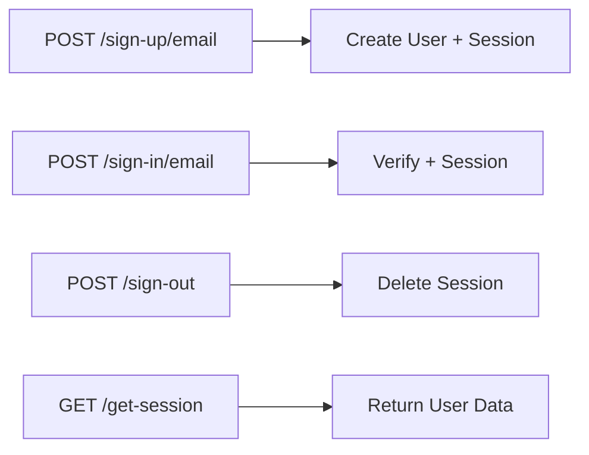
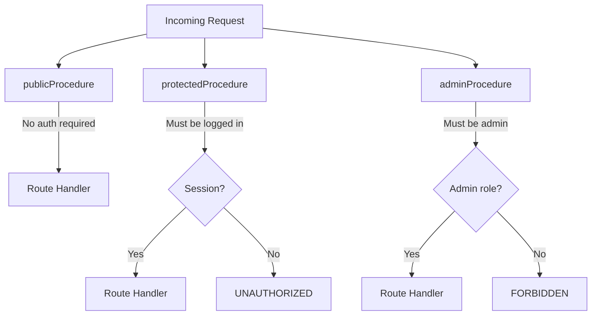

# API Reference

Complete API documentation covering tRPC routes, auth endpoints, file upload, procedure types, and error handling.

## tRPC Routes

All tRPC routes are available at `/api/trpc/*` and through the typed client.

### Admin Routes (`app/trpc/routes/admin.ts`)

| Route | Type | Auth | Description |
|-------|------|------|-------------|
| `admin.getUsers` | query | admin | List all users with roles and ban status |

**Server-side usage:**
```typescript
const users = await context.trpc.admin.getUsers();
```

**Client-side usage:**
```typescript
const { data: users } = api.admin.getUsers.useQuery();
```

### Analytics Routes (`app/trpc/routes/analytics.ts`)

| Route | Type | Auth | Description |
|-------|------|------|-------------|
| `analytics.*` | query | varies | Analytics data endpoints |

## Auth Endpoints

Better Auth handles authentication at `/api/auth/*`.



### Sign Up
```
POST /api/auth/sign-up/email
Body: { email, password, name }
```

### Sign In
```
POST /api/auth/sign-in/email
Body: { email, password }
```

### Sign Out
```
POST /api/auth/sign-out
```

### Get Session
```
GET /api/auth/get-session
Headers: { Cookie: ... }
```

**Client usage:**
```typescript
import { authClient } from "@/auth/client";

await authClient.signUp.email({ email, password, name });
await authClient.signIn.email({ email, password });
await authClient.signOut();
const { data: session } = authClient.useSession();
```

## File Upload

### Upload File
```
POST /api/upload-file
Content-Type: multipart/form-data
Body: FormData with 'file' field

Response: { url: string }
```

```typescript
const formData = new FormData();
formData.append('file', file);

const response = await fetch('/api/upload-file', {
  method: 'POST',
  body: formData,
});
const { url } = await response.json();
```

## Procedure Types

tRPC routes use different procedure types for authorization:



| Procedure | Requirement | Context Available |
|-----------|-------------|-------------------|
| `publicProcedure` | None | Basic context |
| `protectedProcedure` | Logged in | `ctx.auth.user` |
| `adminProcedure` | Admin role | `ctx.auth.user.role === 'admin'` |

## Context Object

Available in tRPC routes and loaders:

```typescript
interface Context {
  db: DrizzleD1Database;     // Database connection
  auth: BetterAuth;          // Auth instance
  trpc: TRPCCaller;          // Server-side tRPC caller
  env: Env;                  // Cloudflare env bindings
  posthog?: PostHog;         // Feature flags (if configured)
  stripe?: Stripe;           // Stripe client (if configured)
}
```

## Error Responses

### tRPC Error Codes
```typescript
{
  error: {
    message: string;
    code: 'UNAUTHORIZED' | 'FORBIDDEN' | 'NOT_FOUND' | 'BAD_REQUEST' | ...;
  }
}
```

### Repository Errors

| Error | HTTP Equivalent | Use Case |
|-------|-----------------|----------|
| `NotFoundError` | 404 | Record not found |
| `ValidationError` | 400 | Invalid input |
| `CreationError` | 500 | Insert failed |
| `UpdateError` | 500 | Update failed |
| `DeletionError` | 500 | Delete failed |
| `BucketError` | 500 | R2 operation failed |
| `BucketUploadError` | 500 | R2 upload failed |

## Cross-References

- [Architecture Overview](./overview.md) — route map and system context
- [Security Model](./security.md) — authorization layers and RBAC
- [Data Models](./data-models.md) — schema that backs these APIs
