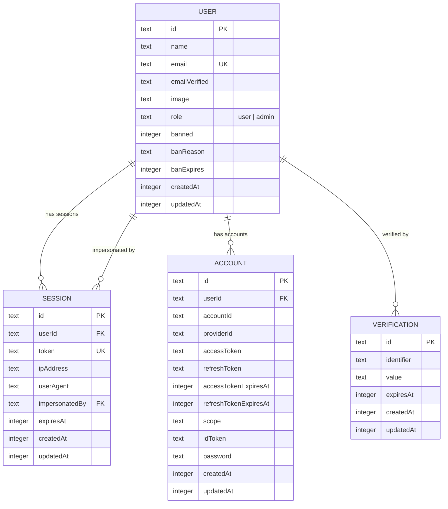
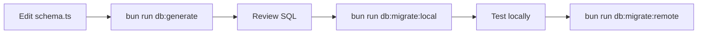

# Data Models

Database schema documentation covering table definitions, entity relationships, conventions, and migration patterns.

## Schema Location

**Primary source:** `app/db/schema.ts`

Always read the schema file directly for the most current table definitions.

## Entity Relationships



## Tables Overview

| Table | Purpose | Key Relations |
|-------|---------|---------------|
| `user` | Core user with roles and ban system | Referenced by session, account |
| `session` | Active user sessions | Links to user, tracks impersonation |
| `account` | OAuth/credential accounts | Belongs to user |
| `verification` | Email verification tokens | Links to user by email |

## SQLite Conventions

This project uses Cloudflare D1 (SQLite) with Drizzle ORM. Follow these conventions:

### Booleans
```typescript
integer("col", { mode: "boolean" })
// Stored as 0/1 in SQLite, typed as boolean in TypeScript
```

### Timestamps
```typescript
integer("col", { mode: "timestamp_ms" })
  .$defaultFn(() => new Date())
// Stored as Unix epoch milliseconds
```

### Enums
```typescript
text("col", { enum: ["user", "admin"] })
// Stored as TEXT with app-level validation
```

### Required Fields
Every table should include:
- `createdAt` — timestamp of record creation
- `updatedAt` — timestamp of last modification

### Primary Keys
```typescript
text("id")
  .primaryKey()
  .$defaultFn(() => crypto.randomUUID())
```

## Migration Workflow



| Command | Purpose |
|---------|---------|
| `bun run db:generate` | Generate migration from schema changes |
| `bun run db:migrate:local` | Apply to local D1 |
| `bun run db:migrate:remote` | Apply to production D1 |
| `bun run db:studio` | Open Drizzle Studio (visual browser) |

**Migration files location:** `drizzle/`

## Repository Pattern

Repositories are pure data access functions:

```typescript
// app/repositories/user.ts
import type { Database } from "@/db";

export async function getUser(db: Database, input: { userId: string }) {
  const result = await db.query.user.findFirst({
    where: eq(user.id, input.userId),
  });
  if (!result) throw new NotFoundError("User not found");
  return result;
}
```

Rules:
- First parameter is always `db: Database`
- Use typed input interfaces, not raw params
- Throw custom errors from `app/models/errors/`
- Never import tRPC or access session/context directly

## Cross-References

- [Architecture Overview](./overview.md) — ER diagram and key files
- [API Reference](./api.md) — tRPC routes that use these models
- [Security Model](./security.md) — authorization that protects this data
