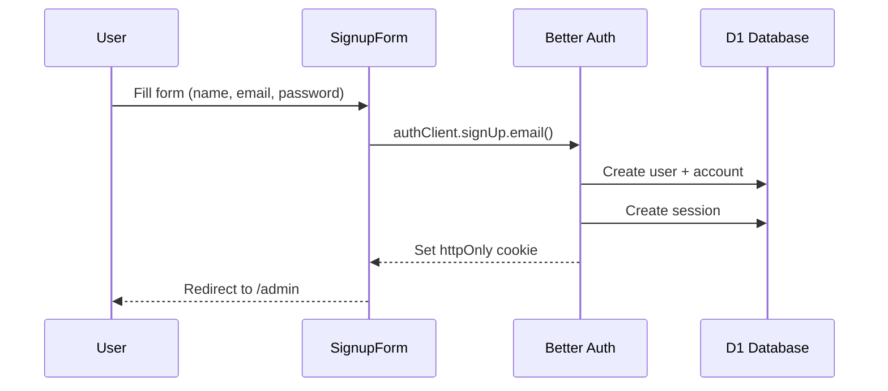
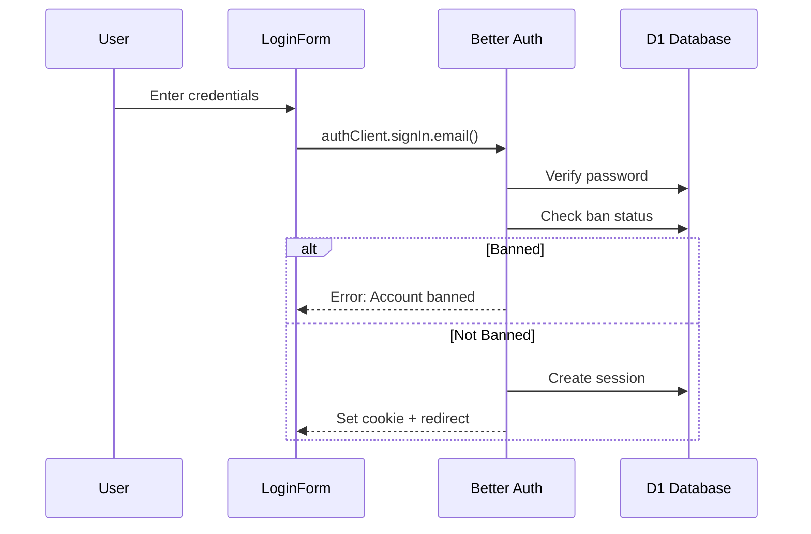
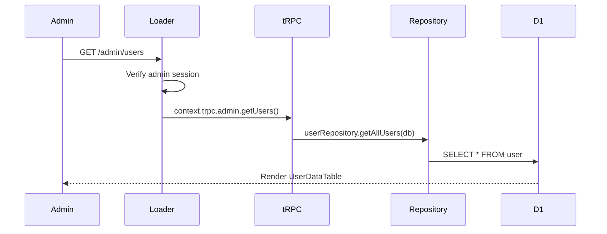
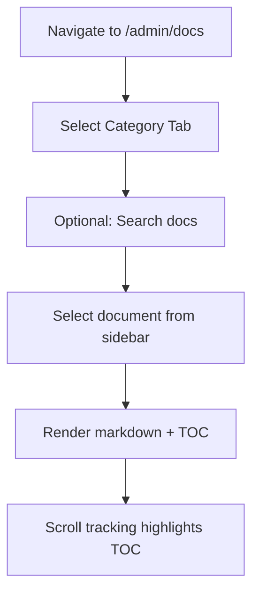
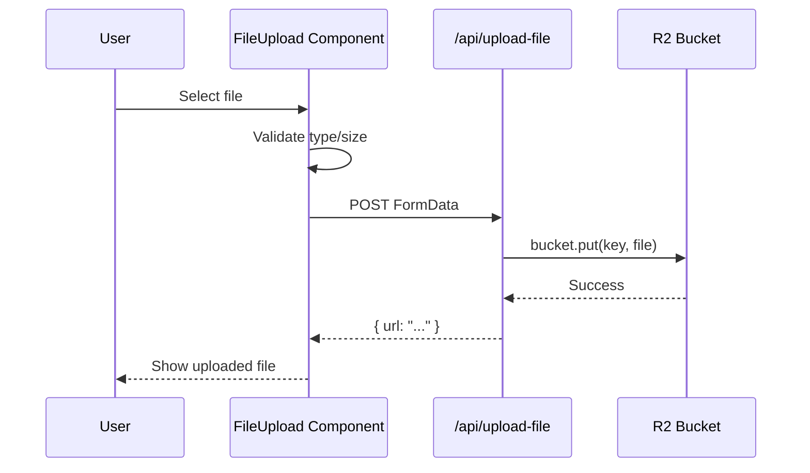

# Feature Catalog

Comprehensive documentation of all features with flow diagrams, capabilities, and key files.

## Authentication

### Overview
Email/password authentication using Better Auth with role-based access control.

### Capabilities
- Email/password sign up and login
- User roles: `user`, `admin`
- Ban system with reason and optional expiration
- Admin impersonation for support/debugging
- Session management with device tracking

### Registration Flow

### Login Flow

### Key Files
| File | Purpose |
|------|---------|
| `app/auth/server.ts` | Better Auth server configuration |
| `app/auth/client.ts` | Client-side auth hooks |
| `app/routes/authentication/sign-up.tsx` | Sign up page |
| `app/routes/authentication/login.tsx` | Login page |
| `app/routes/authentication/components/` | Form components |

---

## Admin Dashboard

### Overview
Protected admin area with user management, analytics, and documentation.

### Capabilities
- User listing with search/filter
- Ban/unban users with reasons
- User impersonation
- Analytics charts (area charts, stat cards)
- Documentation viewer (7 categories)

### User Management Flow

### Key Files
| File | Purpose |
|------|---------|
| `app/routes/admin/_layout.tsx` | Admin layout with sidebar |
| `app/routes/admin/_index.tsx` | Dashboard with analytics |
| `app/routes/admin/users.tsx` | User management page |
| `app/routes/admin/components/user-data-table.tsx` | User table |
| `app/trpc/routes/admin.ts` | Admin tRPC routes |

---

## Admin Documentation Viewer

### Overview
Markdown documentation viewer with category-based organization, Mermaid diagram support, and full-text search.

### Capabilities
- 7 categories: Architecture, Design, Meetings, Ideas, Plans, Features, Releases
- Markdown rendering with GitHub Flavored Markdown
- Syntax highlighting via Shiki
- Mermaid diagram rendering
- Table of contents with scroll tracking
- Search/filter documents within categories
- URL-based state for direct linking

### Document Viewing Flow

### Key Files
| File | Purpose |
|------|---------|
| `app/routes/admin/docs.tsx` | Documentation page component |
| `app/components/markdown-renderer.tsx` | Markdown + Mermaid renderer |
| `docs/` | Static markdown files organized by category |

---

## File Upload

### Overview
File upload to Cloudflare R2 storage with validation and public URL generation.

### Capabilities
- Direct upload to R2
- File type validation
- Size limits
- Returns public URL

### Upload Flow

### Key Files
| File | Purpose |
|------|---------|
| `app/components/file-upload.tsx` | Upload component |
| `app/routes/api/upload-file.ts` | Upload API route |
| `app/repositories/bucket.ts` | R2 operations |

---

## Analytics Dashboard

### Overview
Interactive charts and metrics displayed on the admin dashboard homepage.

### Capabilities
- Area charts for time series data
- Stat cards with trend indicators
- Interactive data visualization using Recharts

### Key Files
| File | Purpose |
|------|---------|
| `app/routes/admin/_index.tsx` | Dashboard page |
| `app/routes/admin/components/chart-area-interactive.tsx` | Charts |
| `app/routes/admin/components/section-cards.tsx` | Stat cards |
| `app/components/analytics/` | Reusable analytics components |

## Cross-References

- [Architecture Overview](./overview.md) — route map and feature flows
- [API Reference](./api.md) — endpoints backing these features
- [User Journeys](./user-journeys.md) — end-to-end user flows
- [Security Model](./security.md) — auth protecting these features
