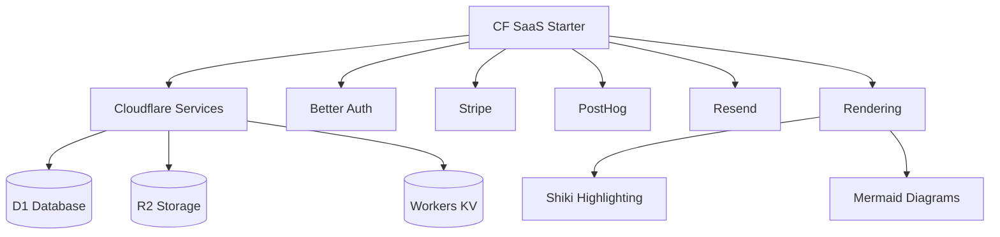
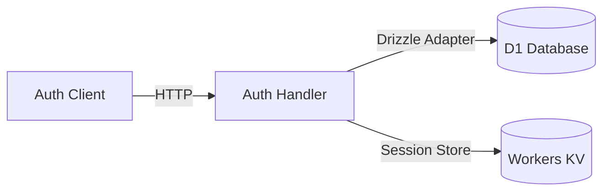

# Third-Party Integrations

Documentation of all external services, their configuration, and usage patterns.

## Integration Overview



## Cloudflare Services

### D1 Database
SQLite database at the edge, accessed via Drizzle ORM.

```typescript
// Access via context
const db = ctx.db;  // DrizzleD1Database

// In repositories
export async function getUser(db: Database, id: string) {
  return db.query.user.findFirst({ where: eq(user.id, id) });
}
```

**Configuration:** `wrangler.jsonc`

### R2 Storage
Object storage for file uploads.

```typescript
// Access via context.env
const bucket = ctx.env.BUCKET;
await bucket.put(key, file);
const url = `${publicUrl}/${key}`;
```

**Key files:** `app/repositories/bucket.ts`

### Workers KV
Key-value storage used for sessions by Better Auth.

**Configuration:** `wrangler.jsonc`

---

## Better Auth

Authentication library configured for Cloudflare Workers.

### Architecture



### Server Setup
```typescript
// app/auth/server.ts
export const auth = betterAuth({
  database: drizzleAdapter(db, { provider: "sqlite" }),
  // ... config
});
```

### Client Setup
```typescript
// app/auth/client.ts
import { createAuthClient } from "better-auth/react";
export const authClient = createAuthClient();
```

### Usage Patterns
```typescript
// Server: Check session in loader
const session = await context.auth.api.getSession({ headers: request.headers });

// Client: Sign in
await authClient.signIn.email({ email, password });

// Client: Get session hook
const { data: session } = authClient.useSession();
```

---

## Stripe (Optional)

Payment processing via Stripe.

### Access Pattern
```typescript
// ALWAYS use context.stripe, never create client in repositories
const stripe = ctx.stripe;
const session = await stripe.checkout.sessions.create({...});
```

### Webhook Handling
```typescript
// app/routes/api/stripe-webhook.ts
const event = stripe.webhooks.constructEvent(body, sig, secret);
switch (event.type) {
  case 'checkout.session.completed':
    // Handle payment
    break;
}
```

---

## PostHog (Optional)

Feature flags and product analytics.

### Server-Side Feature Flags
```typescript
const isEnabled = await context.posthog?.isFeatureEnabled('feature-name', userId);
```

### Client-Side Analytics
```typescript
import { posthog } from 'posthog-js';
posthog.capture('button_clicked', { button: 'signup' });
const isEnabled = posthog.isFeatureEnabled('feature-name');
```

---

## Resend (Email)

Email sending via Resend SDK.

```typescript
import { Resend } from 'resend';
const resend = new Resend(env.RESEND_API_KEY);

await resend.emails.send({
  from: 'noreply@example.com',
  to: user.email,
  subject: 'Welcome!',
  html: generateWelcomeEmail(user),
});
```

**Email templates:** `app/lib/constants/emails.ts`

---

## Rendering Libraries

### Shiki (Syntax Highlighting)
```typescript
import { codeToHtml } from 'shiki';
const html = await codeToHtml(code, {
  lang: 'typescript',
  themes: { light: 'github-light', dark: 'github-dark' },
});
```

### Mermaid (Diagrams)
```typescript
import mermaid from 'mermaid';
mermaid.initialize({ startOnLoad: false });
const { svg } = await mermaid.render('id', diagramCode);
```

**Key files:** `app/components/markdown-renderer.tsx`

---

## Integration Checklist

When adding a new integration:

1. Add to `wrangler.jsonc` if Cloudflare service
2. Add environment variables to `.dev.vars`
3. Create client instance in `workers/app.ts` context
4. Pass through tRPC context to routes and repositories
5. Create repository if data access needed
6. Add to context type in `workers/app.ts`
7. Create `.cursor/rules/` file for patterns
8. Update this document and `.cursor/context/integrations.md`

## Cross-References

- [System Architecture](./system.md) — how integrations fit in the stack
- [Security Model](./security.md) — auth integration details
- [API Reference](./api.md) — endpoints using these integrations
