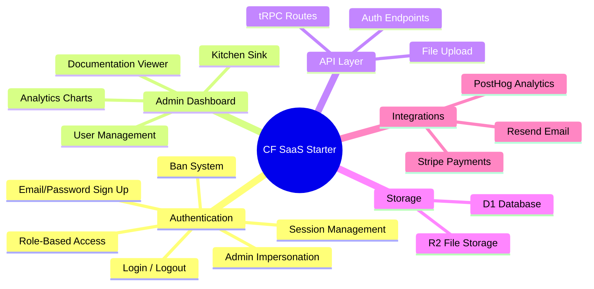
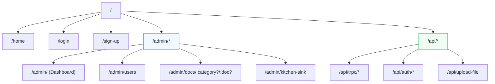
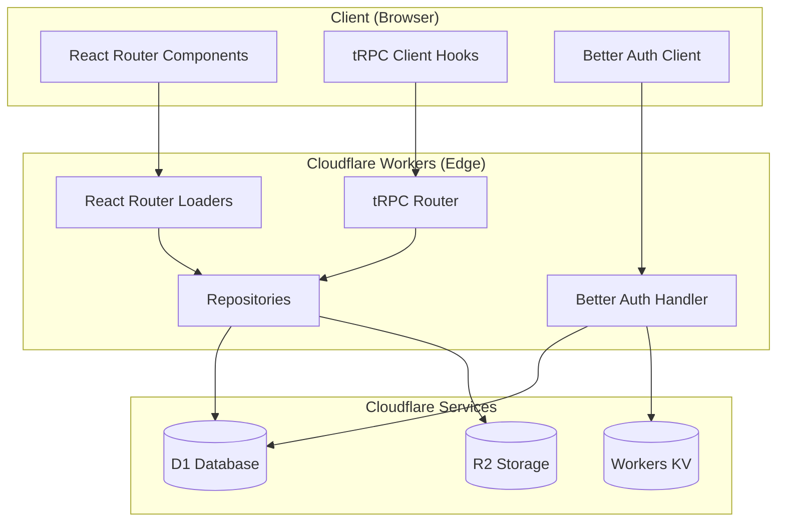
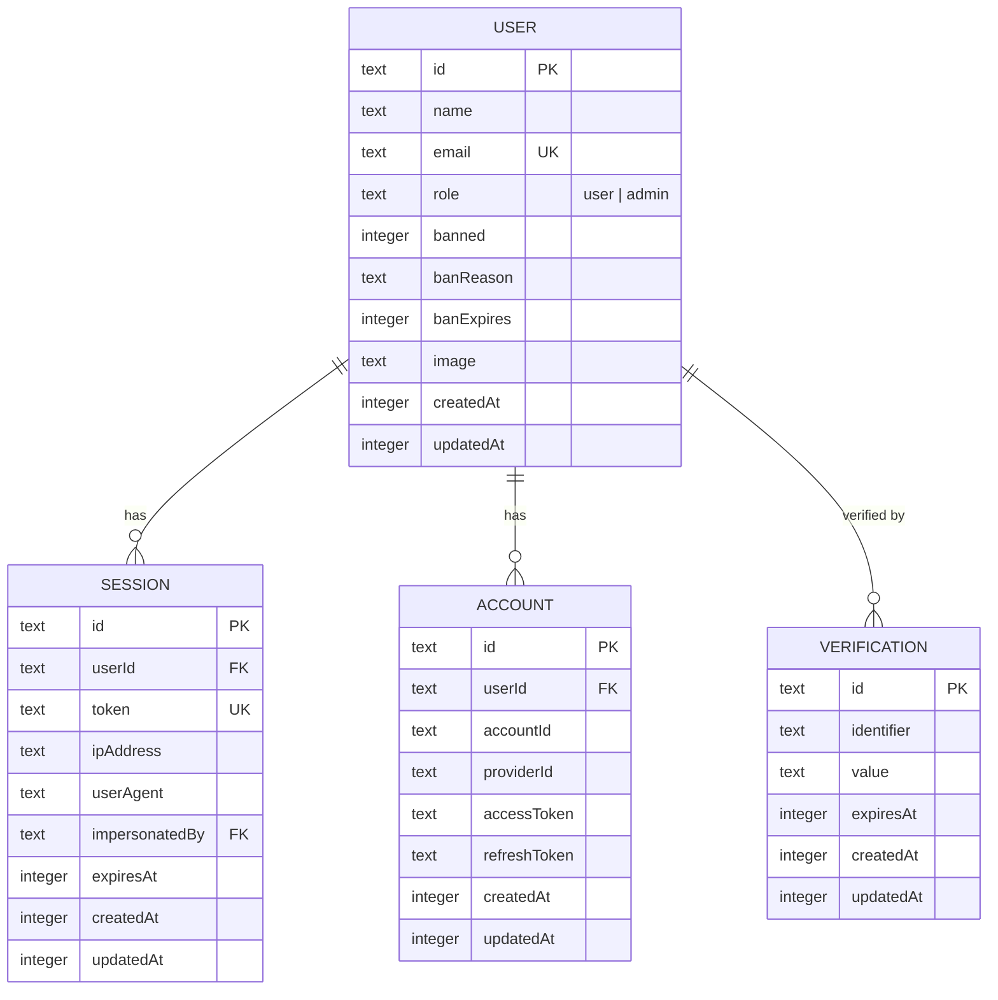
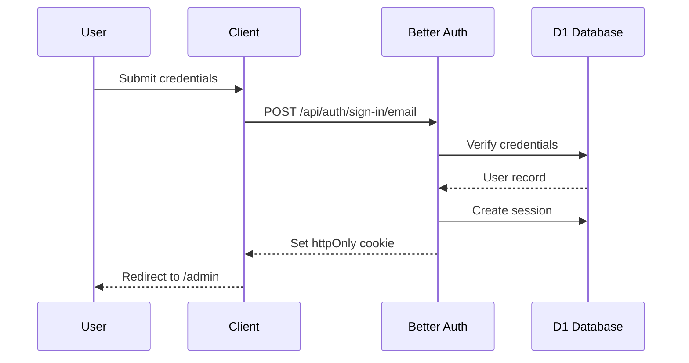
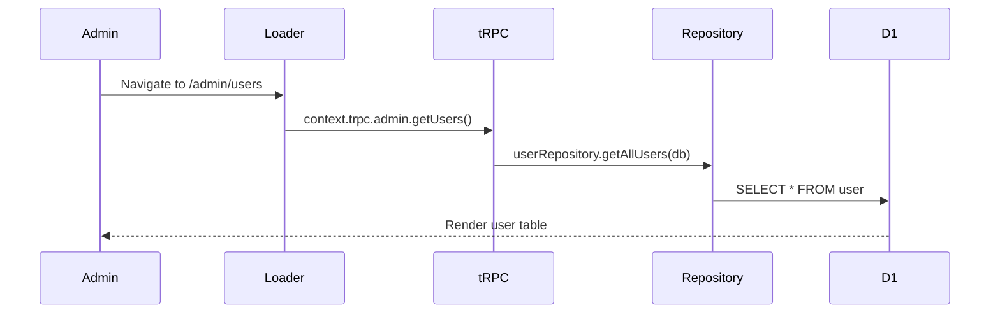

# Architecture Overview

Master architecture document for the CF SaaS Starter — a full-stack SaaS boilerplate built on Cloudflare Workers, React Router v7, tRPC, D1/Drizzle, Better Auth, and ShadCN/Tailwind.

## Product Mindmap



## Route Map



## Information Architecture

| Route | File | Auth | Purpose |
|-------|------|------|---------|
| `/` | `routes/home.tsx` | Public | Landing page |
| `/login` | `routes/authentication/login.tsx` | Public | Login form |
| `/sign-up` | `routes/authentication/sign-up.tsx` | Public | Registration form |
| `/admin/` | `routes/admin/_index.tsx` | Admin | Dashboard with analytics |
| `/admin/users` | `routes/admin/users.tsx` | Admin | User management table |
| `/admin/docs/:category?/:doc?` | `routes/admin/docs.tsx` | Admin | Documentation viewer |
| `/admin/kitchen-sink` | `routes/admin/kitchen-sink.tsx` | Admin | Component showcase |
| `/api/trpc/*` | `routes/api/trpc.$.ts` | Varies | tRPC API handler |
| `/api/auth/*` | `routes/api/auth.$.ts` | Public | Better Auth handler |
| `/api/upload-file` | `routes/api/upload-file.ts` | Protected | R2 file upload |

## System Architecture



## Data Flow

### Server-Side Rendering
```
Route Loader → context.trpc.routeName.method() → Repository → D1 → Response via useLoaderData()
```

### Client-Side Fetching
```
Component → api.routeName.useQuery() → /api/trpc/* → tRPC Router → Repository → D1
```

### Mutations
```
Component → api.routeName.useMutation() → /api/trpc/* → tRPC Router → Repository → D1
                                                                                    ↓
                                                              onSuccess → invalidate queries
```

## Data Relationships



## Feature Flows

### Authentication Flow



### Admin User Management



## Key Files Reference

| Layer | File | Purpose |
|-------|------|---------|
| Entry | `workers/app.ts` | Worker entry, context creation |
| Routes | `app/routes.ts` | Route definitions |
| tRPC | `app/trpc/router.ts` | Combined tRPC router |
| tRPC Context | `app/trpc/index.ts` | Context, middleware, procedures |
| DB Schema | `app/db/schema.ts` | Drizzle table definitions |
| Auth Server | `app/auth/server.ts` | Better Auth configuration |
| Auth Client | `app/auth/client.ts` | Client-side auth hooks |

## Cross-References

- **System details**: [System Architecture](./system.md)
- **API reference**: [API Documentation](./api.md)
- **Data models**: [Data Models](./data-models.md)
- **Features**: [Feature Catalog](./features.md)
- **Integrations**: [Third-Party Integrations](./integrations.md)
- **Security**: [Security Model](./security.md)
- **User flows**: [User Journeys](./user-journeys.md)
- **Design system**: [Design System Overview](../design/design-system-overview.md)

## Changelog

### 2026-02-15 - Documentation System Overhaul
- Added: Architecture documentation at `docs/architecture/`
- Added: Design system documentation at `docs/design/`
- Added: Architecture and Design tabs to admin docs viewer
- Changed: Default docs tab from "features" to "architecture"

### 2026-01-24 - Initial Setup
- Added: Admin documentation viewer with 5 categories
- Added: Markdown rendering with Mermaid diagram support
- Added: Authentication system with Better Auth
- Added: Admin dashboard with user management
