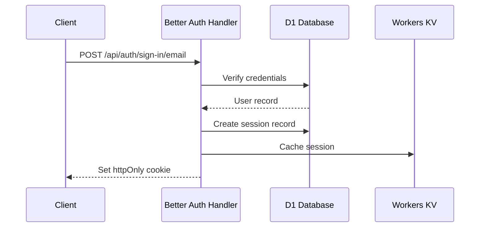
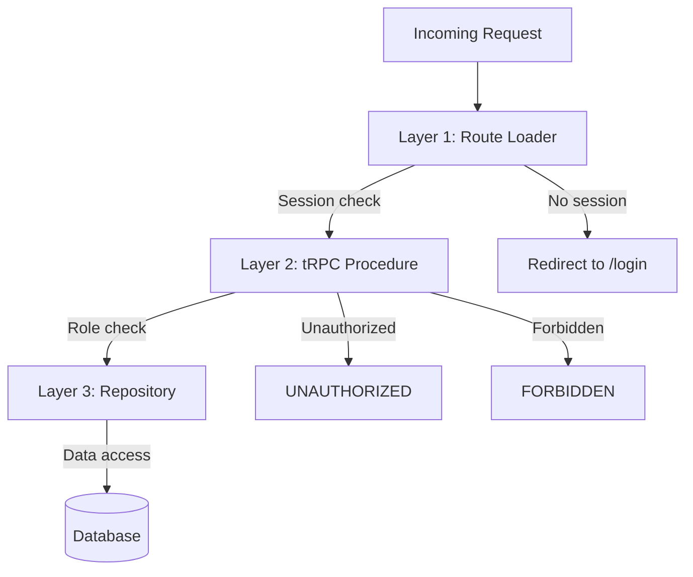
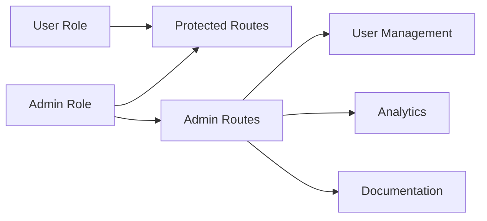
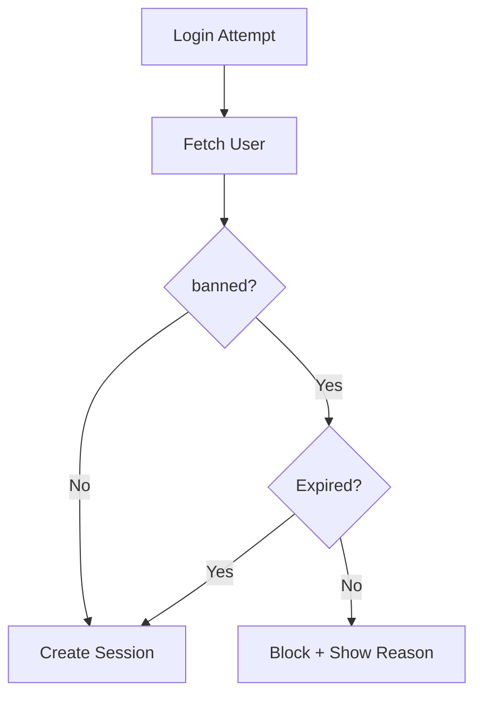
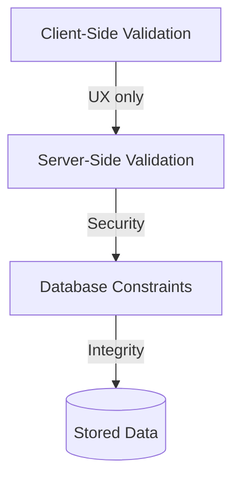

# Security Model

Authentication, authorization, session management, and security patterns used throughout the application.

## Authentication Flow



## Session Management

### Session Storage
- Sessions stored in D1 database (`session` table)
- Session token in httpOnly cookie (not accessible via JavaScript)
- Includes IP address and user agent for auditing
- Optional impersonation tracking (`impersonatedBy` field)

### Session Validation
```typescript
// In loaders — always check session first
const session = await context.auth.api.getSession({
  headers: request.headers,
});
if (!session) return redirect("/login");
```

### Impersonation
```typescript
// session.impersonatedBy contains admin's user ID when impersonating
if (session.impersonatedBy) {
  // Currently impersonating another user
}
```

## Authorization Layers

The application uses three layers of authorization:



### Layer 1: Route Protection (Loaders)
```typescript
export async function loader({ request, context }: Route.LoaderArgs) {
  const session = await context.auth.api.getSession({ headers: request.headers });
  if (!session) return redirect("/login");
  if (session.user.role !== "admin") return redirect("/");
  return { user: session.user };
}
```

### Layer 2: tRPC Procedures
```typescript
// Public - no auth required
export const publicProcedure = t.procedure;

// Protected - must be logged in
export const protectedProcedure = t.procedure.use(async ({ ctx, next }) => {
  if (!ctx.auth.user) throw new TRPCError({ code: "UNAUTHORIZED" });
  return next({ ctx: { ...ctx, user: ctx.auth.user } });
});

// Admin - must have admin role
export const adminProcedure = protectedProcedure.use(async ({ ctx, next }) => {
  if (ctx.user.role !== "admin") throw new TRPCError({ code: "FORBIDDEN" });
  return next({ ctx });
});
```

### Layer 3: Repository Validation
Repositories receive validated data and don't perform auth checks:
```typescript
export async function updateUser(db: Database, input: UpdateUserInput) {
  // No auth check — caller (tRPC route) handles that
  return db.update(user).set(input).where(eq(user.id, input.id));
}
```

## Role-Based Access Control (RBAC)



| Role | Capabilities |
|------|-------------|
| `user` | Access protected routes, manage own data |
| `admin` | All user capabilities + admin routes, user management, impersonation |

### Role Checks
```typescript
// In components
{session.user.role === "admin" && <AdminOnlyFeature />}

// In tRPC middleware
.use(({ ctx, next }) => {
  if (ctx.user.role !== "admin") throw new TRPCError({ code: "FORBIDDEN" });
  return next({ ctx });
})
```

## Ban System

### Ban Structure
```typescript
{
  banned: boolean;
  banReason: string | null;
  banExpires: number | null;  // Unix timestamp, null = permanent
}
```

### Ban Check Flow



## Input Validation

### Three-Layer Validation



1. **Client-side** (React Hook Form + Zod) — for UX, not security
2. **Server-side** (tRPC + Zod) — required validation
3. **Database-level** (Drizzle schema constraints) — data integrity

## Security Headers

Cloudflare Workers provides:
- HTTPS enforcement
- DDoS protection

Application should add:
```typescript
headers.set("X-Content-Type-Options", "nosniff");
headers.set("X-Frame-Options", "DENY");
headers.set("Referrer-Policy", "strict-origin-when-cross-origin");
```

## Secrets Management

| Environment | Storage | Access |
|-------------|---------|--------|
| Development | `.dev.vars` (gitignored) | `context.cloudflare.env.SECRET` |
| Production | Cloudflare Dashboard / `wrangler secret put` | Same binding access |

**Never:** commit secrets to git, log secrets, expose in client bundles.

## Cross-References

- [API Reference](./api.md) — procedure types and error responses
- [Data Models](./data-models.md) — session and user schemas
- [User Journeys](./user-journeys.md) — auth flows from user perspective
