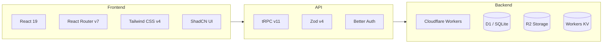
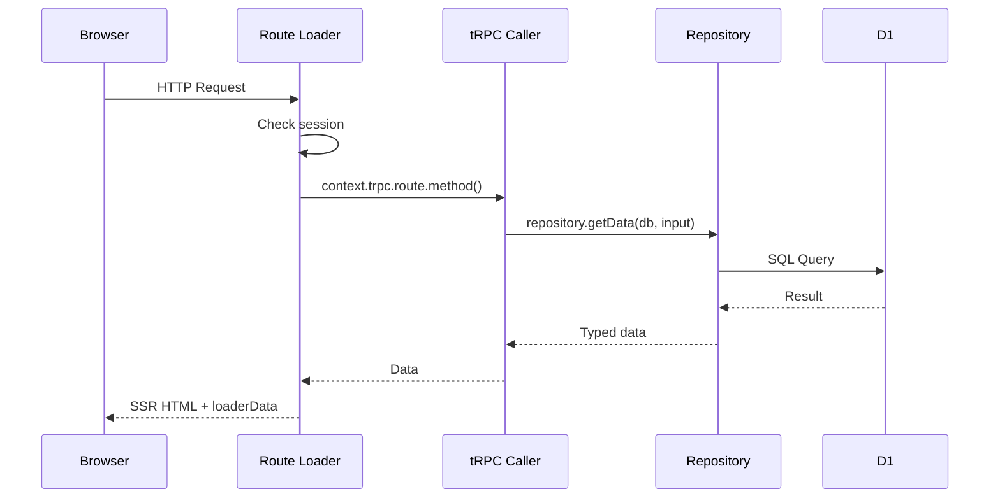
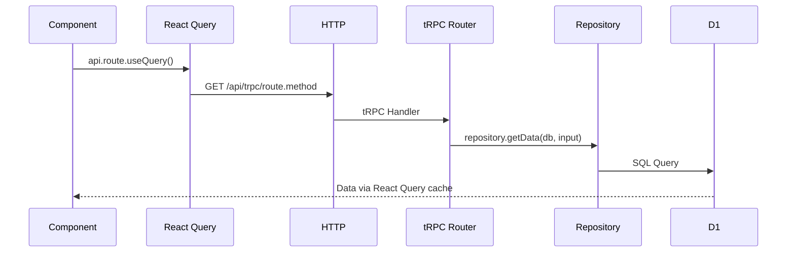
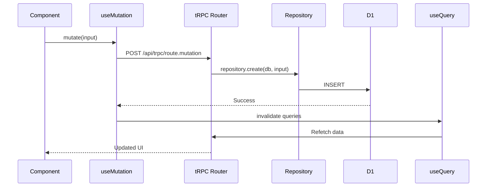

# System Architecture

Detailed system architecture for the CF SaaS Starter, covering the tech stack layers, data flow patterns, and component responsibilities.

## Technology Stack



## Architecture Diagram

```
┌─────────────────────────────────────────────────────────────────┐
│                        Client (Browser)                         │
│  ┌─────────────┐  ┌─────────────┐  ┌─────────────────────────┐ │
│  │ React Router│  │ tRPC Client │  │ Better Auth Client      │ │
│  │ Components  │  │ Hooks       │  │ (useSession, signIn)    │ │
│  └──────┬──────┘  └──────┬──────┘  └───────────┬─────────────┘ │
└─────────┼────────────────┼─────────────────────┼───────────────┘
          │                │                     │
          ▼                ▼                     ▼
┌─────────────────────────────────────────────────────────────────┐
│                   Cloudflare Workers (Edge)                     │
│  ┌─────────────┐  ┌─────────────┐  ┌─────────────────────────┐ │
│  │ React Router│  │ tRPC Router │  │ Better Auth Handler     │ │
│  │ Loaders     │  │ /api/trpc/* │  │ /api/auth/*             │ │
│  └──────┬──────┘  └──────┬──────┘  └───────────┬─────────────┘ │
│         │                │                     │                │
│         └────────────────┼─────────────────────┘                │
│                          ▼                                      │
│                 ┌─────────────────┐                             │
│                 │  Repositories   │                             │
│                 │  (Data Access)  │                             │
│                 └────────┬────────┘                             │
└──────────────────────────┼──────────────────────────────────────┘
                           │
                           ▼
┌─────────────────────────────────────────────────────────────────┐
│                    Cloudflare Services                          │
│  ┌─────────────┐  ┌─────────────┐  ┌─────────────────────────┐ │
│  │ D1 Database │  │ R2 Storage  │  │ Workers KV (sessions)   │ │
│  │ (SQLite)    │  │ (Files)     │  │                         │ │
│  └─────────────┘  └─────────────┘  └─────────────────────────┘ │
└─────────────────────────────────────────────────────────────────┘
```

## Data Flow Patterns

### Server-Side Rendering (Loaders)



**Key point**: Server-side tRPC calls via `context.trpc.*` have **no HTTP roundtrip** — they call procedures directly.

### Client-Side Data Fetching



### Mutations with Cache Invalidation



## Layer Responsibilities

### Routes (`app/routes/`)
- Page components and layouts
- Server loaders for SSR data fetching
- Session checks and redirects
- Client-side interactivity and navigation
- Form handling

### tRPC Routes (`app/trpc/routes/`)
- Input validation using Zod schemas
- Authorization via procedure types (`publicProcedure`, `protectedProcedure`, `adminProcedure`)
- Orchestrate repository calls
- Transform data for client consumption

### Repositories (`app/repositories/`)
- Pure database operations
- No auth/context awareness — always receive `db: Database` as first param
- Throw typed errors (`NotFoundError`, `CreationError`, etc.)
- Single responsibility per function

### Models (`app/models/`)
- Zod schemas for validation
- TypeScript type definitions
- Custom error classes (`app/models/errors/`)

## Key Files

| Layer | Location | Purpose |
|-------|----------|---------|
| Entry | `workers/app.ts` | Cloudflare Worker entry, context creation |
| Routes | `app/routes.ts` | All route definitions (flat, not filesystem) |
| tRPC | `app/trpc/router.ts` | Combined tRPC router |
| tRPC Context | `app/trpc/index.ts` | Context creation, middleware, procedures |
| tRPC Routes | `app/trpc/routes/` | Individual sub-routers |
| tRPC Client | `app/trpc/client.tsx` | Client-side React Query provider |
| DB Schema | `app/db/schema.ts` | Drizzle table definitions |
| Auth Server | `app/auth/server.ts` | Better Auth server config |
| Auth Client | `app/auth/client.ts` | Better Auth React client |

## Runtime: Cloudflare Workers

This project runs on Cloudflare Workers, **not Node.js**. Key differences:

- **No `process.env`** — access environment through Cloudflare bindings
- **In loaders/actions**: `context.cloudflare.env.BINDING_NAME`
- **In tRPC routes**: `ctx.db` (pre-built), `ctx.cfContext.BINDING_NAME`
- **Available bindings**: `DATABASE` (D1), `BUCKET` (R2), `AI`, `BETTER_AUTH_SECRET`, `EXAMPLE_WORKFLOW`
- **Configuration**: `wrangler.jsonc` and `worker-configuration.d.ts`

## Cross-References

- [Architecture Overview](./overview.md) — master doc with route map and changelog
- [API Documentation](./api.md) — tRPC routes and auth endpoints
- [Data Models](./data-models.md) — database schema and conventions
