# User Journeys

End-to-end user flows, admin journeys, and error states with visual diagrams.

## Authentication Flows

### Sign Up (New User)

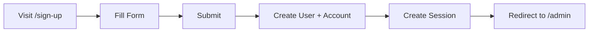

**Key files:** `app/routes/authentication/sign-up.tsx`, `app/auth/server.ts`

### Login (Existing User)

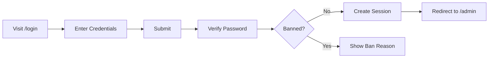

**Key files:** `app/routes/authentication/login.tsx`

### Logout

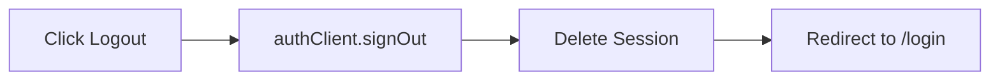

## Admin Journeys

### User Management

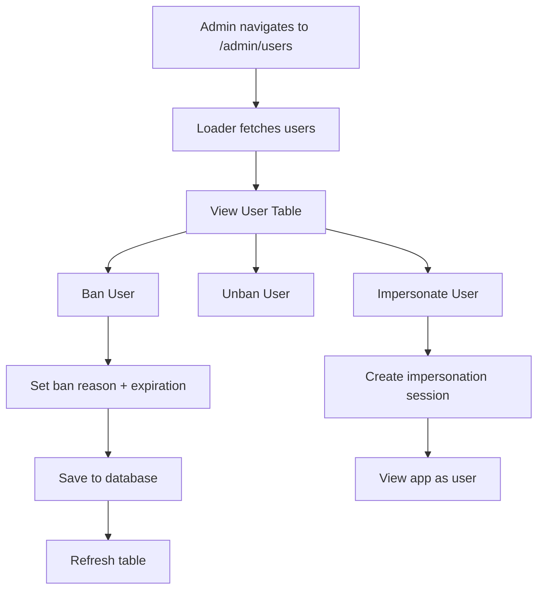

**Key files:** `app/routes/admin/users.tsx`, `app/trpc/routes/admin.ts`

### Documentation Viewing

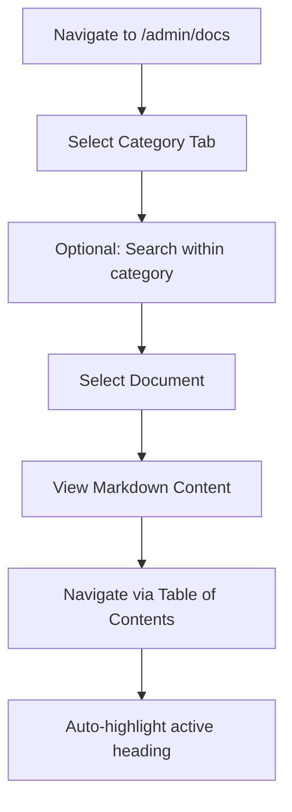

**Key files:** `app/routes/admin/docs.tsx`

### Dashboard Overview

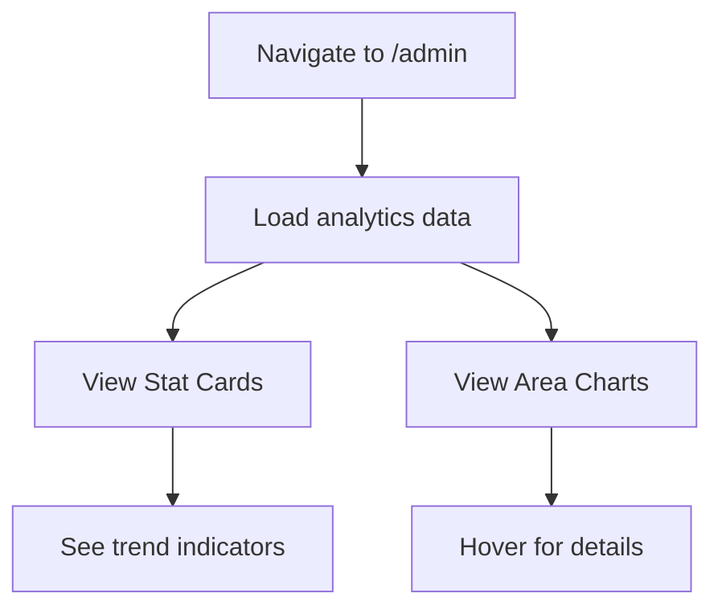

**Key files:** `app/routes/admin/_index.tsx`

## File Upload Journey

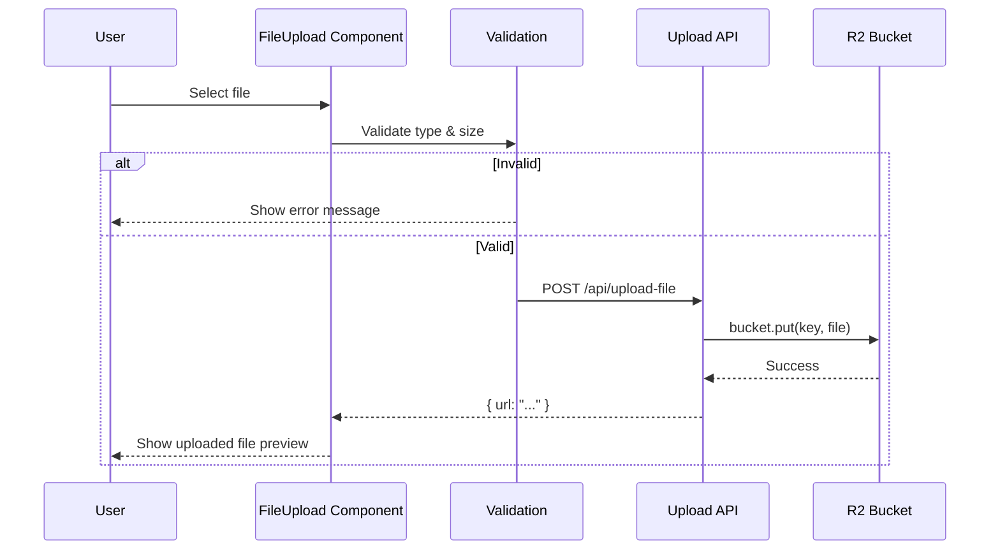

**Key files:** `app/components/file-upload.tsx`, `app/routes/api/upload-file.ts`

## Role-Based Access

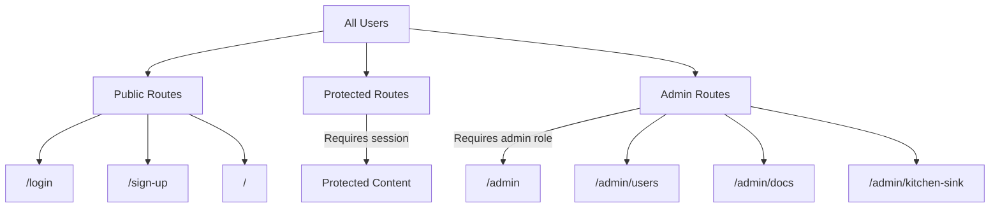

## Error States

### Banned User Login Attempt

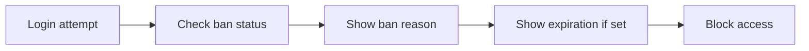

### Session Expired

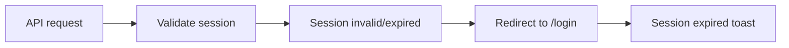

### Unauthorized Admin Access

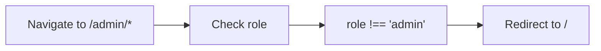

## Cross-References

- [Authentication feature](./features.md#authentication) — detailed auth capabilities
- [Security Model](./security.md) — authorization layers protecting these journeys
- [Architecture Overview](./overview.md) — route map showing all paths
